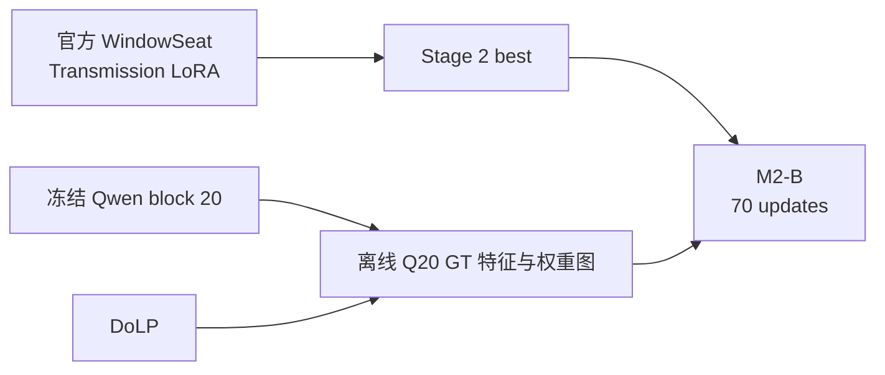
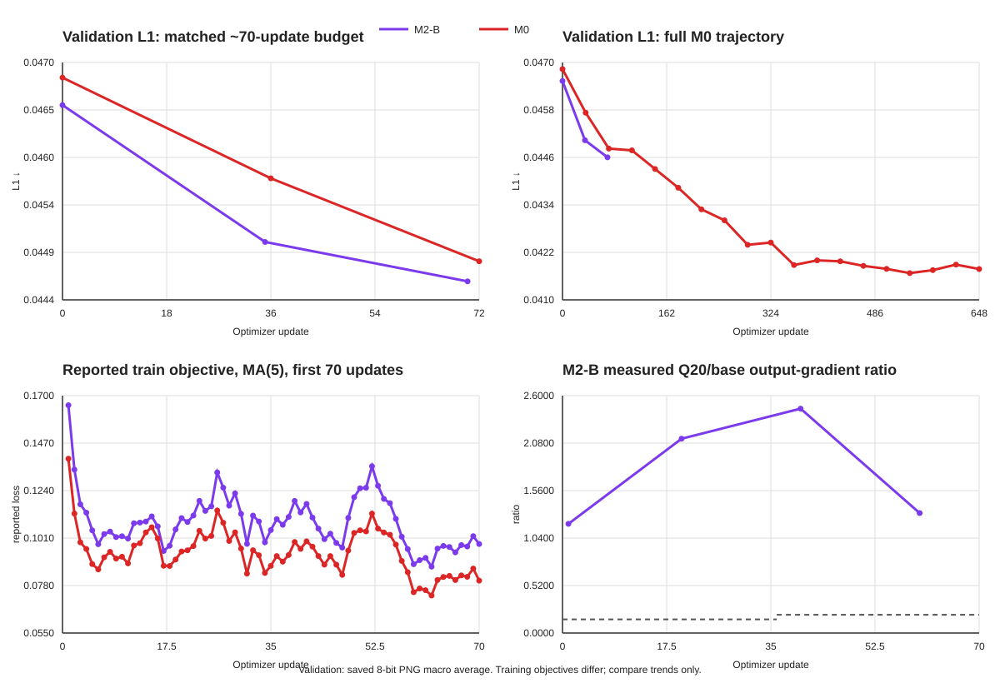

# M2-B 模型来历、损失设计与实验结论

> 2026-10-03 来历审计：该模型继承 Stage 2，而 M2 测试集的六张裁剪图来自 Stage 2 训练场景。本文的既有指标有效，但“封存”仅指当前 M2 划分，不能解释为全训练历史从未见过。详情与视觉证据见 [M1–M4 历史审计](../M5branch/M1_TO_M4_EVIDENCE_AND_PIXEL_RESTORATION.md)。

> 本文以 M2-B 的实际训练源码、归档配置、完整 JSONL 日志和纠正标签后的封存测试结果为准。

## 1. 模型身份与当前保存状态

M2-B 的正式实验名为 `M2-B-corrected-q20full70`。它不是新的主干网络，而是在 WindowSeat 的 rank-128 Transmission LoRA 上继续训练 70 次更新。

| 项目 | 固定值 |
|---|---|
| 训练代码提交 | `1e25b9e509317737a6bc53cdf4208f8a9aab8073` |
| M2-B best 权重 SHA-256 | `446eeba602b6cfdc8bc5cd359d7c9b6615ae92dec22ceba07415b8fba3c31dee9` |
| 基础模型 | `Qwen/Qwen-Image-Edit-2509` |
| 可训练部分 | rank-128 Transmission LoRA，约 8.52 亿参数 |
| 冻结部分 | Qwen DiT 主干、Qwen VAE、固定文本条件 |
| 初始化 | Stage 2 best Transmission LoRA |
| 初始化 SHA-256 | `f5737d4ffb89e86874a96a02bd58a074299ca12e00ec15cac438c403a342085a` |
| 推理输入 | 普通含反射图 `I` |
| 训练额外输入 | GT、DoLP 和离线 Q20 缓存 |
| P90 | 不读取 |

此前清理运行目录时，M2-B 的 3.4 GB LoRA 权重已经删除；上表 SHA、完整训练日志、验证结果、18 张封存测试预测和指标仍保存在 `results_archive/M2/`。因此本文可以完整复核训练和结果，但当前不能直接加载 M2-B 权重做新推理。如需恢复模型，需要按归档配置从 Stage 2 best 重跑 70 步。

## 2. 模型来历

权重演化路径如下：

Stage 2 在第一批 512×384 数据上对官方 WindowSeat LoRA 做配对监督训练。M2-B 随后改用纠正标签后的 M2 数据集：144 张训练、18 张验证和 18 张封存测试。图像保留长宽比，通过分桶让四张 GPU 在同一全局 step 处理相近尺寸；每卡仍是单张图。

M2-B 只改变训练监督。推理结构保持 WindowSeat：冻结 VAE 编码输入，冻结 4-bit Qwen DiT 主干执行一次 flow 更新，Transmission LoRA 提供可训练适配，最后由冻结 VAE 解码。

## 3. 离线 Q20 缓存与权重图

缓存生成仅覆盖 144 张训练图。Qwen-Image-Edit 的所有 LoRA 都被关闭，VAE 使用确定性的 posterior mode，flow timestep 固定为 499，并在第 20 个 transformer block 后立即停止。

对每张训练图缓存：

- GT 的完整 Q20 BF16 token 特征；
- Q20 差异图和 DoLP 组合得到的 token 权重；
- 插值到图像尺寸并再次归一化的像素权重。

设普通输入和 GT 的 Q20 token 特征为 `Q20(I)` 和 `Q20(Y)`，原始差异为：

$$
D_Q^{raw}(x)
=1-\cos\left(Q_{20}(I)_x,Q_{20}(Y)_x\right)
$$

每张图按 2% 和 98% 分位数做稳健归一化：

$$
D_Q(x)
=
\operatorname{clip}
\left(
\frac{D_Q^{raw}(x)-q_{0.02}}
{q_{0.98}-q_{0.02}},
0,1
\right)
$$

DoLP 被缩放到 0 至 1，然后只作为 Q20 差异的温和增强：

$$
S(x)=D_Q(x)\left(0.7+0.3D_{DoLP}(x)\right)
$$

原始空间权重为：

$$
W_{raw}(x)=\operatorname{clip}\left(1+2S(x),1,3\right)
$$

token 权重归一化到均值 1：

$$
W_t(x)=\frac{W_{raw}(x)}{\operatorname{mean}_x W_{raw}(x)}
$$

像素权重由 token 权重双线性插值得到，并再次归一化：

$$
W_p(x)=
\frac{\operatorname{Bilinear}(W_t)(x)}
{\operatorname{mean}_x\operatorname{Bilinear}(W_t)(x)}
$$

这个设计以 Q20 差异为主体。DoLP 的乘数范围只有 0.7 至 1.0，因此 DoLP 不能在 Q20 完全无响应的位置单独制造热点；它只能在已有差异的位置调整强度。

需要明确：`D_Q` 使用训练期 GT，它是监督权重，不是推理阶段可计算的反射概率。测试时只输入普通图像。

## 4. 损失构成

### 4.1 基础重建损失

预测 transmission 为：

$$
\hat T=F(I)
$$

基础重建损失为：

$$
L_{base}
=L_1(\hat T,Y)
+0.2\left(1-\operatorname{SSIM}(\hat T,Y)\right)
+0.1L_{edge}(\hat T,Y)
$$

L1 约束整体像素误差，SSIM 约束局部结构，edge 项比较水平与垂直有限差分。

### 4.2 高权重区域恢复

使用像素权重对 Charbonnier 误差加权：

$$
\rho(a,b)=\sqrt{(a-b)^2+10^{-6}}
$$

$$
L_{weighted}
=
\frac{
\sum_x W_p(x)\rho\left(\hat T(x),Y(x)\right)
}{
\sum_x W_p(x)
}
$$

由于 `W_p` 的均值为 1，该项不会仅靠整体放大 loss，而是重新分配空间梯度。

### 4.3 低响应区域保持

先把单张图的像素权重映射到 0 至 1 的相对重要度：

$$
P(x)=
\frac{W_p(x)-\min W_p}
{\max W_p-\min W_p+10^{-6}}
$$

低响应权重为：

$$
K(x)=1-P(x)
$$

保持损失要求模型在低响应区域不要无故偏离输入：

$$
L_{keep}
=
\frac{
\sum_xK(x)\left|\hat T(x)-I(x)\right|
}{
\sum_xK(x)
}
$$

### 4.4 Q20 特征损失

训练时把预测图重新编码到冻结 Qwen block 20。在线教师同样关闭 LoRA，并在 block 20 后停止。预测 Q20 特征与缓存的 GT Q20 特征做加权余弦距离：

$$
L_{Q20}
=
\frac{
\sum_xW_t(x)
\left[
1-\cos\left(Q_{20}(\hat T)_x,Q_{20}(Y)_x\right)
\right]
}{
\sum_xW_t(x)
}
$$

### 4.5 总目标

M2-B 的标量损失为：

$$
L_{M2B}
=L_{base}
+0.25L_{weighted}
+0.10L_{keep}
+\lambda_qL_{Q20}
$$

前三项先组成基础包，Q20 项单独计算输出梯度，再按 `lambda_q` 合并到预测图梯度，最后反传到 Transmission LoRA。Qwen 主干与 VAE均没有参数梯度。

## 5. Q20 梯度控制的计划与实际情况

令基础包与 Q20 项对输出图的梯度分别为：

$$
g_b=\nabla_{\hat T}
\left(
L_{base}+0.25L_{weighted}+0.10L_{keep}
\right)
$$

$$
g_q=\nabla_{\hat T}L_{Q20}
$$

计划目标在第一个 epoch 从 0 线性增加到 15%，后续改为 20%：

$$
\tau(s)=
\begin{cases}
0.15\min\left(1,\frac{s}{36}\right), & \text{epoch 1}\\
0.20, & \text{epoch 2}
\end{cases}
$$

每 20 步重新测量一次梯度，目标系数为：

$$
\lambda_q^{*}
=
\operatorname{clip}
\left(
\tau(s)\frac{\lVert g_b\rVert_2}{\lVert g_q\rVert_2},
0.02,0.5
\right)
$$

再做 EMA：

$$
\lambda_q
=
\operatorname{clip}
\left(
0.9\lambda_q^{prev}+0.1\lambda_q^{*},
0.02,0.5
\right)
$$

实际输出梯度为：

$$
g=g_b+\lambda_qg_q
$$

实际记录显示 `lambda_q` 从头到尾都被下限锁在 0.02。测量点如下：

| step | `lambda_q` | 实际 Q20/基础梯度比 |
|---:|---:|---:|
| 1 | 0.02 | 1.196 |
| 20 | 0.02 | 2.128 |
| 40 | 0.02 | 2.458 |
| 60 | 0.02 | 1.313 |

因此 M2-B 并未实现 15% 至 20% 的计划强度；Q20 输出梯度实际是基础梯度的约 1.2 至 2.5 倍。`M2-B1` 后来允许 `lambda_q` 低于 0.02，把实际比例严格控制为 30%，就是针对这个问题的修正版。

## 6. 最终训练配置

| 参数 | M2-B |
|---|---:|
| 训练图 | 144 |
| 验证图 | 18 |
| 封存测试图 | 18 |
| GPU | 4 |
| 每卡 batch | 1 |
| 有效 batch | 4 |
| 更新次数 | 70 |
| 等效完整 epoch | 约 1.94 |
| 学习率 | `5e-6` |
| warmup | 20 updates |
| 调度器 | cosine |
| 优化器 | `PagedAdamW8bit` |
| weight decay | `0.01` |
| 梯度裁剪 | `1.0` |
| Qwen DiT | NF4 4-bit，BF16 compute |
| 验证与保存 | step 35、70 |
| 随机种子 | 2026 |
| 数据增强 | 同步水平翻转 RGB、权重图、token 网格和 Q20 GT 特征 |
| P90 | 关闭 |
| 峰值显存 | allocated 19.82 GiB；reserved 20.85 GiB |
| 优化耗时 | 388.3 秒，约 5.55 秒/step |

## 7. 损失曲线与 M0 对比

原始曲线数据位于 `figures/m2b_m0_curve_data.csv`。

### 7.1 相同约 70 步预算

验证指标均从保存后的 8 位 PNG 计算，再对 18 张图片做宏平均。

| 模型/时点 | step | L1 ↓ | PSNR ↑ | SSIM ↑ | LPIPS ↓ |
|---|---:|---:|---:|---:|---:|
| M2-B 初始化 | 0 | 0.046533 | 23.7100 | 0.842905 | 0.111015 |
| M2-B 中点 | 35 | 0.045034 | 23.8640 | 0.844492 | 0.111189 |
| **M2-B 结束** | **70** | **0.044602** | **23.9320** | **0.846024** | **0.111703** |
| M0 初始化 | 0 | 0.046834 | 23.5875 | 0.839006 | 0.116203 |
| M0 第 1 epoch | 36 | 0.045731 | 23.7639 | 0.842477 | 0.119046 |
| M0 第 2 epoch | 72 | 0.044822 | 23.8606 | 0.843476 | 0.121613 |

在近似相同更新预算下，M2-B 的 L1 比 M0 低约 0.000220，PSNR 高约 0.0714 dB，SSIM 高约 0.00255，LPIPS 低约 0.00991。

这不是严格的 loss 消融，因为初始化不同：M2-B 从 Stage 2 best 开始，M0 从官方 WindowSeat 开始。曲线能够说明 M2-B 在 70 步内收敛稳定、样本效率较高，不能单独证明差异全部来自 M2-B 的附加 loss。

### 7.2 M0 长训练

M0 继续训练到 step 540 后达到验证 best：L1 为 0.041677，PSNR 为 24.1198，SSIM 为 0.850050，LPIPS 为 0.111531。它最终超过 M2-B 的验证 L1、PSNR 和 SSIM，说明简单重建目标在更多训练预算下仍可继续获益。

训练曲线中的标量也不能直接比较：M0 记录单一 `L_base`，M2-B 记录包含空间项和 Q20 项的 `L_M2B`。图中只比较变化趋势。两者前 70 步都下降，M2-B 没有因较强 Q20 梯度出现发散。

## 8. 封存测试集与 M0 对比

| 模型 | L1 ↓ | PSNR ↑ | SSIM ↑ | LPIPS ↓ | 低变化区 L1 ↓ | 高变化区 L1 ↓ |
|---|---:|---:|---:|---:|---:|---:|
| 输入图 | 0.055954 | 22.2052 | 0.786002 | 0.114393 | 0.011070 | 0.136888 |
| M0 best | 0.049412 | 23.7737 | 0.827890 | 0.116119 | 0.026861 | **0.090369** |
| **M2-B** | **0.048769** | **24.1618** | **0.829621** | **0.114754** | **0.023105** | 0.094873 |

M2-B 相对 M0 best：

- L1 降低 0.000643，约 1.30%；
- PSNR 提高 0.388 dB；
- SSIM 提高 0.00173；
- LPIPS 降低 0.00137；
- 低变化区 L1 降低约 13.98%；
- 高变化区 L1 增加约 4.98%。

M2-B 的优势主要来自整体像素指标和低变化区域保持；M0 对反射变化大的区域恢复更好。验证集上 M0 长训练优于 M2-B，而封存测试上 M2-B 的 PSNR 更高，说明两个小规模划分的排序并不完全一致，也说明单一指标不能代表全部视觉质量。

## 9. 与同预算 M2-A、M2-B1 的消融关系

M2-A、M2-B、M2-B1 使用相同 Stage 2 初始化、相同纠正标签数据、相同 70 步预算和相同随机种子，因此比 M0 更适合判断附加 loss 的作用。

| 模型 | 封存 L1 ↓ | PSNR ↑ | SSIM ↑ | LPIPS ↓ | 低变化区 L1 ↓ | 高变化区 L1 ↓ |
|---|---:|---:|---:|---:|---:|---:|
| M2-A，仅基础重建 | 0.049178 | 24.1084 | 0.829485 | 0.115681 | 0.023887 | **0.094815** |
| **M2-B，完整 Q20 方案** | **0.048769** | **24.1618** | 0.829621 | **0.114754** | 0.023105 | 0.094873 |
| M2-B1，Q20 严格 30% | 0.048828 | 24.1550 | **0.829759** | 0.115080 | **0.023095** | 0.095128 |

M2-B 相对 M2-A 的改进很小但方向较一致：L1、PSNR、SSIM、LPIPS 和低变化区均改善，高变化区基本持平。M2-B1 把 Q20 梯度从 120% 至 250% 降到严格 30% 后，封存结果几乎不变。这说明 M2-B 的好表现不能解释为“大 Q20 梯度带来更好结果”；空间加权、低响应保持以及 Q20 的方向信息可能共同起作用，而 Q20 强度远低于 M2-B 也足够。

## 10. 基于实验结果的 loss 合理性分析

### 10.1 合理且有结果支持的部分

**基础重建项必须保留。** M2-A 和 M0 都证明，只使用 L1、SSIM 和 edge 就能稳定改善。它为生成先验提供像素和结构锚点。

**Q20 主导、DoLP 调制的权重公式合理。** DoLP 只能把 Q20 差异乘以 0.7 至 1.0，不会独立把高偏振但与 GT 无关的位置判成强监督区。这比硬阈值蒙版更稳健。

**空间恢复与低响应保持的组合得到实际支持。** M2-B 相比 M2-A 和 M0 都降低了低变化区 L1；相对 M0 的降幅接近 14%。这与 `L_weighted` 和 `L_keep` 的目标一致。

**动态比例图和长宽比分桶可工作。** 70 步训练没有尺寸错误、NaN 或显存增长，峰值低于单卡 24 GiB。说明不裁成统一比例的 pipeline 是可训练的。

### 10.2 配置上不合理的部分

**`lambda_q=0.02` 的下限过高。** 实际 Q20 梯度远超计划值，控制器没有完成“15% 至 20%”的目标。若将 M2-B 扩展到长训练，这个配置存在让单层教师主导优化的风险。

**单个 Q20 同时承担定位和特征目标。** Q20 的输入/GT 差异既生成空间权重，又监督预测特征，两个项高度相关，可能重复放大同一偏差。后续 M4 把位置、纹理和关系分配到不同深度，正是对此的修正。

**GT 派生权重可能过拟合监督分布。** Q20 差异和权重图都需要 GT，只能作为训练教师。模型在封存测试上表现不错，但验证和测试排序不同，提示权重图可能适应了有限数据的局部统计。

### 10.3 为什么控制失效但结果仍然不错

1. 训练只有 70 步，错误的强度没有持续足够久来造成明显崩坏。
2. Q20 目标使用 GT 特征，整体方向与重建目标相符，强梯度多数时候不是完全相反的方向。
3. L1、SSIM、edge、空间恢复和保持项仍共同约束输出。
4. Stage 2 初始化已经具备去反射能力，M2-B 主要做小幅适配。
5. M2-B1 把 Q20 严格降到 30% 后得到几乎相同结果，说明 M2-B 的性能对过强 Q20 并不敏感，也说明没有必要保留过强设置。

## 11. 结论

M2-B 是一个有效的短预算实验：只训练约 1.94 个 epoch，就在封存测试上取得 24.1618 dB PSNR，并在总体 L1、SSIM、LPIPS 和低变化区保持方面超过 M0 best。它也以相同预算小幅超过 M2-A。

它不是适合直接扩展的最终训练配置。`lambda_q` 下限导致实际 Q20 梯度超过基础梯度，和设计目标明显不符。M2-B 的价值在于证明“Q20 差异加 DoLP 的连续空间权重、局部恢复和低响应保持”具有潜力；后续版本应使用 M2-B1 一类严格梯度控制，或者像 M4 一样拆分不同层的职责。

## 12. 可复核材料

| 材料 | 路径 |
|---|---|
| M2-B 配置 | `results_archive/M2/m2_corrected_b_q20full70/run_config.json` |
| M2-B 全日志 | `results_archive/M2/m2_corrected_b_q20full70/metrics.jsonl` |
| M2-B 训练摘要 | `results_archive/M2/m2_corrected_b_q20full70/training_summary.json` |
| 三组封存测试汇总 | `results_archive/M2/m2_corrected_three_way_test/summary.json` |
| 封存测试预测图 | `results_archive/M2/m2_corrected_three_way_test/predictions/M2-B/` |
| M0 配置与日志 | `runs/M0_windowseat_m2_e18/` |
| 曲线原始数据 | `docx/M2branch/figures/m2b_m0_curve_data.csv` |
| 曲线图 | `docx/M2branch/figures/m2b_vs_m0_loss_curves.svg` |
| M2-B 实现 | `src/rmagnet/m2b_q20.py` |
| 权重图实现 | `src/rmagnet/m2a_prepare.py` |
