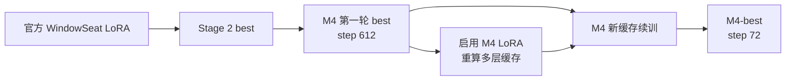
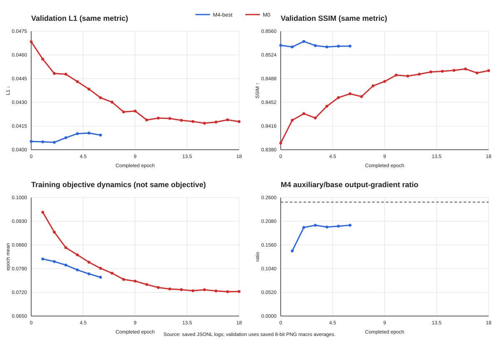

# M4-best 模型来历、损失设计与实验结论

> 本文是 M4-best 的唯一规范说明。内容以最终权重、实际源码、`run_config.json` 和 `metrics.jsonl` 为准，而不是早期设计假设。

## 1. 最终模型身份

最终讨论的 M4-best 是：

```text
runs/m4_best_newcache_e20_p4/best_transmission_lora.safetensors
```

| 项目 | 固定值 |
|---|---|
| 权重 SHA-256 | `897282b1bb9cfe61f96530df72edcf8a44a066bb819a3663e9100862aefdb2aa3` |
| 产生代码提交 | `190f078c1d5e6821dab5c6cba280e80836ca5055` |
| 基础模型 | `Qwen/Qwen-Image-Edit-2509` |
| Qwen revision | `d3968ef930e841f4c73640fb8afa3b306a78167e` |
| WindowSeat revision | `c1f59ca02bff68535c976e5e17147b3d9323309e` |
| WindowSeat 代码提交 | `e5ccbebd583ba53f385092ff5cb02898f1645709` |
| 可训练部分 | rank-128 Transmission LoRA，约 8.52 亿参数 |
| 冻结部分 | Qwen DiT 主干、Qwen VAE、固定文本条件 |
| 推理输入 | 一张普通含反射图像 `I` |
| 推理输出 | 去反射 transmission 图像 |
| 训练专用输入 | 配对 GT、同场景 P90 反射增强图、离线 Qwen 多层缓存 |

M4-best 没有增加第二个可训练 DiT，也没有训练 VAE。它沿用 WindowSeat 的一次 flow 编辑路径，只更新原有 Transmission LoRA；多层 Qwen 特征在训练时充当冻结教师信号，推理时不会读取 GT、P90 或缓存。


## 2. 权重来历

M4-best 不是从官方 WindowSeat 权重直接进行一次训练得到，而是经过四段连续演化：

1. **官方 WindowSeat 初始化**：官方 rank-128 Transmission LoRA 建立单图去反射能力。
2. **Stage 2**：在第一批 512×384 配对数据上继续训练 Transmission LoRA，得到 `stage2_transmission_r128/best_transmission_lora.safetensors`，SHA-256 为 `f5737d...2085a`。
3. **M4 第一轮**：从 Stage 2 best 出发，在纠正标签后的 M2 数据集上使用多层监督训练；`m4_e30_p4` 在 step 612 得到 best，SHA-256 为 `5725d3...1a13eb`。
4. **M4-best 新缓存续训**：启用第三步 best LoRA，重新提取 144 张训练图的全部多层缓存，再从同一权重继续训练；最终在 step 72 得到本文的 M4-best。



这条来历决定了如何解释实验：M4-best 相对 M0 的领先来自“更长的训练历史、P90 一致性、多层监督和缓存自蒸馏”的合成效果。最终新缓存续训本身只带来很小的验证集改进，不能把全部差距归因于最后 72 次更新。

## 3. 数据与缓存口径

数据版本是 `m2-variable-aspect-v2-corrected-labels`，manifest SHA-256 为：

```text
9b329cb62121ce92972e70254e4d5b45545e8178f63883a7b3478e7a39c115ce
```

划分固定为 144 张训练、18 张验证、18 张封存测试。图像按长宽比分桶并保留比例；每卡 batch 为 1，不把不同尺寸堆叠进同一个本地 batch。验证集和封存测试集不参与缓存生成。

最终缓存位于：

```text
data_cache/m4_best_multilayer_v1/
```

缓存大小约 4.42 GiB，特征为 BF16，门控为 FP16。缓存教师使用 M4 第一轮 best LoRA，全部参数冻结；VAE 使用确定性的 posterior mode，flow timestep 固定为 499。

各层职责如下：

| 层 | 缓存或在线用途 | 目标 |
|---|---|---|
| Q16、Q20 | 缓存 `I/GT` 特征，在线提取预测特征 | 文字、边缘、局部纹理的保持与恢复 |
| Q37、Q39、Q41 | 缓存 GT 特征，在线提取预测特征 | 内容表示与相邻 token 关系 |
| Q52、Q54、Q56 | 仅离线比较 `I/GT` | 生成反射变化位置门控 |

缓存目标由“启用 M4 第一轮 LoRA 的冻结教师”生成；在线预测特征计算时暂时关闭 LoRA，以免教师反向图把梯度写入待训练适配器。这会产生轻微的特征空间不对称，因此辅助梯度必须受严格上限约束。

## 4. 基础重建与偏振一致性

设 `Y` 为 GT，`F` 为当前 Transmission LoRA 模型，普通输入和 P90 输出分别为：

$$
\hat T_I=F(I),\qquad \hat T_{90}=F(P90)
$$

单分支重建损失为：

$$
L_{\mathrm{rec}}(X,Y)
=L_1(X,Y)
+0.2\left(1-\operatorname{SSIM}(X,Y)\right)
+0.1L_{\mathrm{edge}}(X,Y)
$$

其中 `L_edge` 比较水平和垂直有限差分。L1 提供稳定的像素恢复，SSIM 约束局部结构，edge 项避免边缘和笔画只靠平均亮度匹配。

偏振一致性使用晚层门控 `G` 加权的 Charbonnier 距离。对两个输出定义：

$$
L_{\mathrm{cons}}(A,B;G)
=
\frac{\sum_x\left(1+G(x)\right)
\sqrt{\left(A(x)-B(x)\right)^2+10^{-6}}}
{\sum_x\left(1+G(x)\right)}
$$

实现采用双向 stop-gradient：

$$
L_{\mathrm{polar}}
=
\frac{1}{2}L_{\mathrm{cons}}
\left(\hat T_I,\operatorname{sg}(\hat T_{90});G\right)
+
\frac{1}{2}L_{\mathrm{cons}}
\left(\hat T_{90},\operatorname{sg}(\hat T_I);G\right)
$$

基础目标为：

$$
L_{\mathrm{base}}
=
\frac{1}{2}L_{\mathrm{rec}}(\hat T_I,Y)
+
\frac{1}{2}L_{\mathrm{rec}}(\hat T_{90},Y)
+
0.10L_{\mathrm{polar}}
$$

`P90` 只参与训练。双向 stop-gradient 使两个分支分别收到“向另一个当前输出靠近”的梯度，避免在同一子图中互相追逐。

## 5. 晚层位置门控与空间损失

对晚层集合中的每一层，先计算输入和 GT token 的余弦差异：

$$
D_l(x)=1-\cos\left(Q_l(I)_x,Q_l(Y)_x\right)
$$

每层使用 2% 和 98% 分位数做稳健归一化：

$$
\bar D_l(x)=
\operatorname{clip}
\left(
\frac{D_l(x)-q_{0.02}(D_l)}
{q_{0.98}(D_l)-q_{0.02}(D_l)},
0,1
\right)
$$

三层均值和一致性为：

$$
\mu_D(x)=\frac{\bar D_{52}(x)+\bar D_{54}(x)+\bar D_{56}(x)}{3}
$$

$$
A(x)=
\operatorname{clip}
\left(
1-2\operatorname{std}
\left(\bar D_{52}(x),\bar D_{54}(x),\bar D_{56}(x)\right),
0,1
\right)
$$

最终门控为：

$$
G(x)=\mu_D(x)\left(0.75+0.25A(x)\right)
$$

像素恢复权重归一化到均值 1：

$$
W(x)=\frac{1+2G(x)}{\operatorname{mean}_x\left(1+2G(x)\right)}
$$

空间损失同时处理“该恢复的地方”和“该保持的地方”：

$$
L_{\mathrm{restore}}
=
\operatorname{mean}_x
\left[
W(x)\rho\left(\hat T_I(x)-Y(x)\right)
\right]
$$

$$
L_{\mathrm{keep}}
=
\frac{
\sum_x\left(1-G(x)\right)
\rho\left(\hat T_I(x)-I(x)\right)
}{
\sum_x\left(1-G(x)\right)
}
$$

$$
L_{\mathrm{spatial}}
=0.75L_{\mathrm{restore}}+0.25L_{\mathrm{keep}}
$$

这里的 `rho` 是带 `10^-6` 稳定项的 Charbonnier 距离。该项只作用于普通输入分支，避免 P90 分支的增强反射改变“原图应该保持什么”的定义。

## 6. 前层纹理监督

门控置信度以及保持、恢复权重为：

$$
C(x)=0.5+0.5A(x)
$$

$$
M_{\mathrm{keep}}(x)=\left(1-G(x)\right)C(x)
$$

$$
M_{\mathrm{restore}}(x)=G(x)C(x)
$$

对于 Q16 和 Q20，预测特征在低门控区域靠近输入特征，在高门控区域靠近 GT 特征：

$$
L_{\mathrm{texture}}^{l}
=
\frac{
\sum_x M_{\mathrm{keep}}(x)d\left(Q_l(\hat T_I)_x,Q_l(I)_x\right)
+
\sum_x M_{\mathrm{restore}}(x)d\left(Q_l(\hat T_I)_x,Q_l(Y)_x\right)
}{
\sum_x\left(M_{\mathrm{keep}}(x)+M_{\mathrm{restore}}(x)\right)
}
$$

$$
d(a,b)=1-\cos(a,b)
$$

最终取两层均值：

$$
L_{\mathrm{texture}}
=\frac{L_{\mathrm{texture}}^{16}+L_{\mathrm{texture}}^{20}}{2}
$$

## 7. 中层内容与关系监督

中层特征先减去 token 均值再归一化，以减弱整体曝光和白平衡偏移：

$$
\widetilde Q_l
=
\operatorname{normalize}
\left(
Q_l-\operatorname{mean}_{token}(Q_l)
\right)
$$

对 Q37、Q39 和 Q41，内容损失为：

$$
L_{\mathrm{content}}^{l}
=
\frac{
\sum_x C(x)
\left[
1-\cos\left(\widetilde Q_l(\hat T_I)_x,\widetilde Q_l(Y)_x\right)
\right]
}{
\sum_x C(x)
}
$$

相邻 token 的关系定义为：

$$
R_l(x,y)=\cos\left(\widetilde Q_l(x),\widetilde Q_l(y)\right)
$$

关系损失对水平、垂直相邻边计算 Smooth L1，并用边两端平均置信度加权。三层分别取平均后：

$$
L_{\mathrm{semantic}}
=0.7L_{\mathrm{content}}+0.3L_{\mathrm{relation}}
$$

中层被称为“语义组”只是职责命名。现有实验已观察到这些层仍响应曝光变化，因此它们不是纯语义表示；中心化和关系约束只是在降低光度干扰。

## 8. 实际优化不是固定系数的总和

M4 没有直接使用一个固定标量式把所有损失相加。原因是 Qwen 不同层的损失数值和对输出图的梯度尺度相差数个数量级。训练先分别求它们对普通输出图的梯度：

$$
g_b=\nabla_{\hat T_I}L_{\mathrm{base},I}
$$

$$
g_s=\nabla_{\hat T_I}L_{\mathrm{spatial}},\qquad
g_t=\nabla_{\hat T_I}L_{\mathrm{texture}},\qquad
g_m=\nabla_{\hat T_I}L_{\mathrm{semantic}}
$$

每组辅助梯度的目标比例均为 8%，前 36 次更新线性渐入：

$$
r_s=r_t=r_m=0.08
$$

$$
u(s)=\min\left(1,\frac{s}{36}\right)
$$

缩放系数由梯度范数比确定，再做 EMA 平滑：

$$
\alpha_k
=
\operatorname{EMA}_{0.9}
\left[
\operatorname{clip}
\left(
u(s)r_k\frac{\lVert g_b\rVert_2}{\lVert g_k\rVert_2+10^{-12}},
10^{-4},10
\right)
\right]
$$

合并辅助梯度后设置 25% 的硬上限：

$$
g_{aux}=\alpha_sg_s+\alpha_tg_t+\alpha_mg_m
$$

$$
\widetilde g_{aux}
=g_{aux}\cdot
\min\left(
1,
\frac{0.25\lVert g_b\rVert_2}{\lVert g_{aux}\rVert_2+10^{-12}}
\right)
$$

普通输入分支回传：

$$
g_I=g_b+\widetilde g_{aux}
$$

P90 分支只回传基础重建和一致性梯度：

$$
g_{90}=\nabla_{\hat T_{90}}L_{\mathrm{base},90}
$$

因此不能把日志中的 `spatial`、`texture` 和 `semantic` 原始数值乘以 0.08 后相加。真正控制训练强度的是输出梯度比例。

## 9. 最终训练配置

| 参数 | M4-best 最终值 |
|---|---:|
| GPU | 4 |
| 每卡 batch | 1 |
| 有效 batch | 4 |
| 每 epoch 更新数 | 36 |
| 学习率 | `5e-6` |
| 优化器 | `PagedAdamW8bit` |
| weight decay | `0.01` |
| LR warmup | 20 updates |
| 调度器 | cosine |
| 混合精度 | BF16 |
| Qwen DiT 量化 | NF4 4-bit，BF16 compute |
| 梯度裁剪 | `1.0` |
| 辅助梯度渐入 | 36 updates |
| 每组辅助目标比例 | 8% |
| 辅助总上限 | 25% |
| 最大 epoch | 20 |
| 早停 | 验证 L1 连续 4 个 epoch 无改善 |
| checkpoint | 只保留 best 与 latest LoRA |
| 随机增强 | 关闭，保证缓存 token 位置严格对齐 |

日志写 `epochs_completed=7`，但实际更新数是 216；按每 epoch 36 次更新计算，实际完成 6 个训练 epoch。这里的 7 包含训练前的初始验证周期。best 出现在 step 72，也就是完成第 2 个训练 epoch 后。

## 10. 损失曲线与 M0 对比



原始曲线数据保存在 `figures/m4_m0_curve_data.csv`。

### 10.1 公平可比的验证曲线

M0 和 M4 均在同一 18 张验证集上，对保存后的 8 位 PNG 做宏平均，因此验证 L1、PSNR、SSIM 和 LPIPS 可以直接比较。

| 模型/时点 | step | 验证 L1 ↓ | PSNR ↑ | SSIM ↑ | LPIPS ↓ |
|---|---:|---:|---:|---:|---:|
| M0 官方初始化 | 0 | 0.046834 | 23.5875 | 0.839006 | 0.116203 |
| M0 best | 540 | 0.041677 | 24.1198 | 0.850050 | 0.111531 |
| M4 新缓存续训初始化 | 0 | 0.040524 | 24.1420 | 0.853845 | 0.108373 |
| **M4-best** | **72** | **0.040466** | **24.1412** | **0.854445** | **0.108406** |
| M4 早停点 | 216 | 0.040924 | 24.0538 | 0.853735 | 0.109392 |

相对 M0 best，M4-best 的验证 L1 降低约 2.90%，SSIM 提高 0.004395，LPIPS 降低 0.003125；PSNR 只提高 0.0214 dB。M4 的主要优势体现在结构和感知指标，而像素峰值信噪比几乎持平。

M4 新缓存续训从 step 0 到 step 72 的 L1 只下降 0.000057，约 0.14%；PSNR 和 LPIPS 没有同步改善。这说明重算缓存后的最后阶段属于小幅校准，M4 的主体能力已经在此前 Stage 2 和 M4 第一轮形成。

### 10.2 训练目标曲线的解释限制

图中训练曲线不是同一个标量目标：

- M0 曲线是单输入的完整重建损失。
- M4 曲线是普通输入与 P90 重建损失的均值，再加偏振一致性代理值；三个 Qwen 辅助项通过梯度控制加入，不体现在该标量中。

所以训练曲线只用于确认各自优化是否稳定，不能用“M4 训练 loss 更低”证明 M4 更好。公平结论应读取验证曲线和封存测试集。

M4 的实际辅助/基础输出梯度比例在首个 epoch 平均为 0.143，之后约为 0.194 到 0.199；全程最大值为 0.25，没有突破硬上限。这证明梯度控制按设计工作，也说明三个名义 8% 的分量合并后并不会机械地等于 24%，因为不同梯度方向会相互增强或抵消。

### 10.3 封存测试集

18 张封存测试集采用同样的保存后 8 位 PNG 宏平均口径：

| 模型 | L1 ↓ | PSNR ↑ | SSIM ↑ | LPIPS ↓ | 低变化区 L1 ↓ | 高变化区 L1 ↓ |
|---|---:|---:|---:|---:|---:|---:|
| 输入图 | 0.055954 | 22.2052 | 0.786002 | 0.114393 | 0.011070 | 0.136888 |
| M0 best | 0.049412 | 23.7737 | 0.827890 | 0.116119 | 0.026861 | 0.090369 |
| **M4-best** | **0.047042** | **24.0414** | **0.833084** | **0.112665** | **0.024219** | **0.090278** |

M4-best 相对 M0：

- L1 降低约 4.80%；
- PSNR 提高约 0.268 dB；
- SSIM 提高约 0.00519；
- LPIPS 降低约 0.00345；
- 低变化区 L1 降低约 9.84%；
- 高变化区 L1 只降低约 0.10%，基本持平。

## 11. 基于结果的损失合理性分析

### 11.1 有较强证据支持的部分

**重建主损失是必要锚点。** M0 只使用重建损失，也能把验证 L1 从 0.046834 稳定降到 0.041677，说明像素、结构和边缘三项足以产生可靠的基础适配。M4 不应移除它们，否则冻结生成先验容易被辅助特征目标带偏。

**空间“恢复 + 保持”双目标与结果一致。** M4 和 M0 的高变化区 L1 几乎相同，但 M4 的低变化区 L1 低约 9.84%。这正符合 `L_spatial` 的设计目的：在保持反射区恢复能力的同时，减少非反射区域的无必要改写。

**前层纹理和边缘监督与 SSIM、LPIPS 改善一致。** M4 在验证和封存测试上同时取得更高 SSIM、更低 LPIPS，且低变化区域更稳。这与 Q16/Q20 的条件式保持目标方向相符，特别适合限制文字笔画、边缘和细纹理被重画。

**梯度比例控制是合理且实际生效的。** 原始纹理和语义损失的数值远大于空间损失，但它们的缩放系数约为 `1e-4` 量级；空间缩放约为 `1e-1`。若直接使用统一固定系数，某一类特征梯度很容易主导训练。当前控制器把总辅助影响稳定限制在基础梯度的约 20%，避免冻结教师覆盖重建目标。

**早停是必要的。** M4 在 step 72 达到最佳，之后验证 L1 连续四轮没有刷新并恶化到 0.040924。继续训练虽然还会降低训练代理值，却不会改善泛化。早停成功阻止模型沿缓存教师和训练集继续过拟合。

### 11.2 只有间接证据的部分

**P90 与 `L_polar` 的独立收益尚未被证明。** M4 高变化区只比 M0 好约 0.10%，不足以单独证明偏振一致性带来明显恢复增益。M4 与 M0 的初始化、训练历史和辅助监督都不同，需要同一初始化下的 P90 消融才能给出因果结论。当前保留它的理由是输出一致性约束稳定、系数只有 0.10，且没有观察到明显破坏。

**中层语义损失的独立收益尚未被证明。** SSIM 和 LPIPS 的提高可能来自空间、纹理或语义组的共同作用。现有训练没有逐项移除 Q37/Q39/Q41，因此只能说结果与设计方向一致，不能说“语义项单独贡献了多少”。

**新缓存自蒸馏的边际收益很小。** 最终续训只把验证 L1 改善约 0.14%，之后很快退化。重新缓存仍可作为对当前模型表示的校准，但不应重复多轮“重算缓存—继续训练”；这会越来越接近自我拟合，并放大已有偏差。

### 11.3 当前损失的风险

1. 晚层门控来自训练期 `I/GT` 差异，它是监督位置，不是推理期可观测反射概率。
2. 中层特征仍响应曝光和白平衡，中心化只能缓解，不能消除。
3. 缓存教师启用上一轮 LoRA，而在线特征教师关闭 LoRA，存在表示偏移。
4. `L_keep` 以输入图为目标；如果低门控区域仍含弱反射，它可能保留残余反射。
5. 最终结论来自 18 张封存测试图，能说明当前数据分布内的泛化，不能代表所有真实世界场景。

## 12. M0 与 M4 的正确结论

M0 证明了：只用官方 WindowSeat 初始化和简单重建损失，增加正确标注的数据量就能取得大部分提升，而且训练更快、更容易解释。

M4 证明了：在已经较强的 Transmission LoRA 上，利用分层 Qwen 教师、位置门控和受控辅助梯度，可以进一步改善低变化区域保持、SSIM 和 LPIPS，并在封存测试上稳定超过 M0。

M4 每步约 11.23 秒，M0 每步约 4.07 秒；M4 在线提取到 Q41 并执行多次 VJP，单步成本约为 M0 的 2.8 倍。当前约 0.268 dB 的封存 PSNR 增益需要用这部分训练成本换取。

因此，在上述自有数据的验证与封存测试范围内，M4-best 是相对 M0 更好的最终权重；M0 仍是必要的简单基线。现有证据支持“多层监督整体有效”，尚不足以证明每个辅助 loss 都不可替代。该结论不代表 M4-best 在其他真实数据集上优于官方 WindowSeat；real20 的补充结果见第 14 节。

## 13. 可复核材料

| 材料 | 路径 |
|---|---|
| M4 最终配置 | `runs/m4_best_newcache_e20_p4/run_config.json` |
| M4 全部日志 | `runs/m4_best_newcache_e20_p4/metrics.jsonl` |
| M4 训练摘要 | `runs/m4_best_newcache_e20_p4/training_summary.json` |
| M4 封存测试 | `runs/m4_best_newcache_e20_p4/sealed_test/summary.json` |
| M0 最终配置 | `runs/M0_windowseat_m2_e18/run_config.json` |
| M0 全部日志 | `runs/M0_windowseat_m2_e18/metrics.jsonl` |
| M0 封存测试 | `runs/M0_windowseat_m2_e18/sealed_test/summary.json` |
| 曲线数据 | `docx/M4branch/figures/m4_m0_curve_data.csv` |
| 曲线图 | `docx/M4branch/figures/m4_vs_m0_loss_curves.svg` |
| 损失实现 | `src/rmagnet/m4_train.py` |


## 14. real20 外部分布补充与 M5 设计边界

2026-10-03 补充：RAGNet real20 的 20 对图像使用同一官方短边分块流程，按原始分辨率、保存后的 8 位 RGB PNG 逐图宏平均，得到：

| 模型 | L1 ↓ | PSNR ↑ | SSIM ↑ |
|---|---:|---:|---:|
| 原生 WindowSeat | **0.032714** | **27.1227** | **0.846409** |
| M0-best | 0.037524 | 26.0971 | 0.829561 |
| M4-best | 0.040727 | 25.5103 | 0.819521 |

M4-best 在 real20 上整体落后官方模型，说明自有封存测试上的收益不能直接外推。样本 22 中 M4 明显抑制汽车反射，PSNR 比官方高 2.4556 dB；样本 47 中亮斑/光幕残留更明显，PSNR 比官方低 3.7136 dB。两张图支持恢复能力互补的假设，但不能单独证明语义层的因果作用。

后续 M5 设计优先冻结该权重，训练 RGB 残余修正网络，另设官方候选与二次处理对照。设计文档见 [M5 残余反射修正方案](../M5branch/M5_RESIDUAL_REFINEMENT_DESIGN.md)。该方案尚未实现或评测；这里不更新 M4 权重、训练配置或历史实验数据。

补充结果源：`runs/real20_windowseat_m4/metrics.csv`、`summary.json` 与 `panels/`。real20 已被查看并用于启发方案，后续在同一数据集上的收益需标记为回顾性评估。
