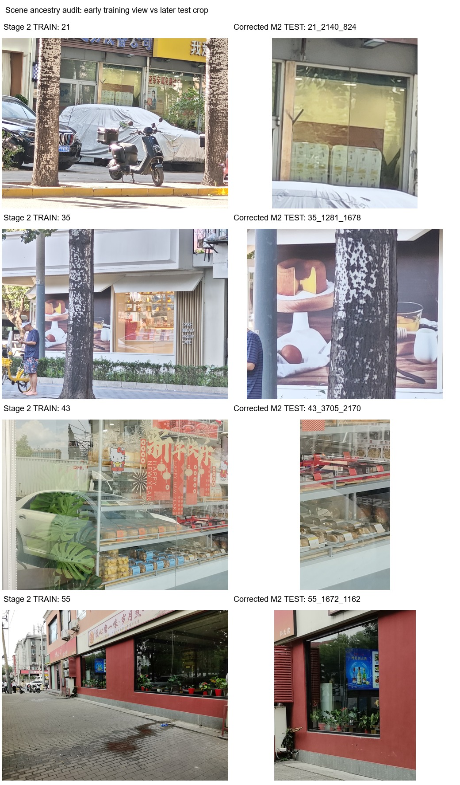
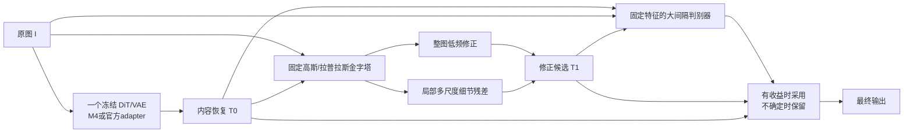

# 从 M1 到 M4：探索历程、失败路线与独立像素恢复设计

日期：2026-10-03。分支：`design/m5-residual-refinement`。本次仅核查文档、配置、Git 历史、既有指标与图片，没有训练或执行新模型推理。

**建议把一个冻结 DiT 作为内容恢复器，把新的可训练容量放到多尺度 RGB 残差网络；用“此次修正是否实际改善”的大间隔判别器控制修正，而不是把高亮或高误差直接当成反射。** 这是当前证据下最值得优先实现的候选，不是已经证实的最优模型。SVM 的理论不能自动保证图像回归或未知分布泛化。

本报告补充并修订 [M5 初稿](M5_RESIDUAL_REFINEMENT_DESIGN.md)，尤其修订门控标签和全训练历史的数据隔离要求。

## 1. 证据范围与一项重要的数据来历问题

索引新机 `srtp_xuke6` 的 226 份 Markdown、JSON、CSV、JSONL，重点读取正式实验文档、配置、逐图指标、相关训练日志与 Git 历史；到旧机 `srtp_xuke` 补查 M1c 正式结果和 Stage 2 保存后 PNG 评价。逐图 CSV 重算结果、文件哈希和几何一致性检查保存于 [`materials/metric_audit.json`](materials/metric_audit.json)。M1c 原始评价补存于 [`materials/early_m1c_evaluation.json`](materials/early_m1c_evaluation.json)。

### 1.1 “当前阶段没训练过”不等于“权重从未见过”

M2 划分在 180 张样本内按场景组隔离，但 M2/M3/M4 的初始化来自 Stage 2。Stage 2 训练过 50 个早期场景。M2 的测试集中有如下六张，来自 Stage 2 训练过的四个场景：

```text
21_2140_824
35_1281_1678
35_3101_1109
43_3705_2170
55_1672_1162
55_3130_569
```

并非只有编号相似。已并排检查早期完整训练图与后来测试裁剪图，21 的黄色窗帘与货物、35 的蛋糕海报、43 的糕点柜台、55 的门店窗户均为同一场景。下图保存了四组视觉证据：



图像来源和哈希见 [`scene_overlap_evidence.json`](materials/scene_overlap_evidence.json)。同样地，M2 验证集有 12/18 张来自早期训练编号 25、36、38、46、47、52、66，对应七个场景；其余场景尚未做逐个视觉审计，不能扩大声称所有编号相似都必然是同一照片。

测试场景 17 则是早期验证图，曾用于选 Stage 2/C1 的权重，虽然没有作为 Stage 2 训练样本，也不是全流程从未查看的测试场景。

因此，原来所谓“纠正标签后的封存测试集”，准确含义应限定为**当前 M2 划分的测试集**。对继承 Stage 2 的模型，它没有隔离全部权重来历。M0 直接从官方 WindowSeat 初始化，而 M4 经 Stage 2，比较二者既有训练预算差异，也有先前接触场景的差异。

原指标有效，不能据此直接证明无泄漏的泛化提升；也不能把全部提升归因于泄漏。需要保留原结果并标记限制。

### 1.2 事后排除来历重合样本的诊断

从既有 CSV 去掉上述六张和早期验证场景 17，剩余 11 张来自七个场景。未执行新推理，仅重算宏平均：

| 模型 | PSNR ↑ | SSIM ↑ | L1 ↓ | LPIPS ↓ |
|---|---:|---:|---:|---:|
| M2-B | **23.4101** | 0.807939 | 0.056252 | 0.115746 |
| M0-best | 22.8786 | 0.805630 | 0.057386 | 0.117154 |
| M4-best | 23.0730 | **0.811673** | **0.054442** | 0.112070 |
| AfterFull M2-B1 latest | 23.1942 | 0.811521 | 0.054717 | **0.109433** |

M4 对 M0 的结构与感知优势在这个子集仍存在，但 M2-B 的 PSNR 仍更好。这个子集是事后选择、样本很少且已被反复查看，不能重新包装为新的独立测试集。

### 1.3 数据版本与指标限制

- M2 输入/GT 在 `d370f74` 纠正；本报告的 M2/M3/M4 表只用纠正后数据。此前错误标签实验不作为模型性能证据。
- 早期 53 组数据采用 `{id}_45_aligned.jpg → {id}_0_aligned.jpg`，M2 原压缩包采用另一套文件命名；不能只根据 `_GT` 字样推断物理身份。
- M1/M1b/M1c 多为三张验证图、512×384；C1 的部分验证是保存前浮点输出；M2 起的对比是保存后 8 位 PNG。不能把所有数值排成同一条排行榜。
- RDNet 的 18 张保存后结果约 22.0665 dB / 0.791536 SSIM，但其评价尺寸对齐到 32 的倍数，部分与 M4 不同，SSIM 实现一致性也未复核；仅作背景结果，不加入本报告同口径排名。

## 2. 探索历程：哪些能力得到过验证

### 2.1 M1/M1a：三套 LoRA 与潜空间融合

结构为共享冻结 Qwen DiT/VAE，加 T、R、Fuse 三套 LoRA。R 分支拟合 P90，T 分支由 WindowSeat 初始化，最后融合 `I/T/R`。首版 Interface Head 关闭。

R 的最佳输出只比复制输入高约 0.535 dB，却比使用 GT 拟合的逐通道 oracle affine 低 0.397 dB；SSIM 还低于复制输入。这支持“主要学到了部分色调映射”的解释，未支持“R 是可靠空间反射专家”。P90 是反射增强的混合观测，并不是纯反射层真值，拟合 P90 不能自动学出纯 R。

Stage 2 T 在三张保存后图上达到 23.1395 dB / 0.821559，比官方 LoRA 的 22.5756 dB / 0.814499 有提升。Stage 3 best 则为 23.035 dB / 0.8157，低于同轮 Stage 2 缓存的约 23.142 dB / 0.8215。R 置零为 23.061 dB，置乱为 23.102 dB，均未稳定劣于正常 R。

**可靠结论：T 微调有方向性收益；当前 R/Fuse 路线未得到收益和因果使用证据。** 不能把潜空间融合未奏效理解为所有 RGB 融合都会失败，但下一轮不能继续把“R90=P90”当作已经验证的反射层。

依据：[M1 总结](../M1branch/M1BRANCH_SUMMARY.md)、[Stage 1 验收](../M1branch/STAGE1_ACCEPTANCE.md)、[Stage 3 正式结果](../M1branch/STAGE3_TEST_RESULTS.md)。

### 2.2 M1b：DINO 整图编码后按 DoLP 硬蒙版监督

训练 A 基础、B 真实蒙版、C 等面积置乱三组，各 100 updates。DINO 先看完整图，再按蒙版加权，流程没有误把蒙版形状本身作为图像输入。

10% 初始语义梯度校准的 A/B/C 全图 PSNR 约 23.1151/23.1423/23.1234。将初始比例提高到 30% 后，B 蒙版 L1 为 0.075058，A 为 0.074705，C 为 0.074397；真实位置没有稳定胜过置乱。10%/30% 是单张初始化点的校准值，并不是全过程恒定梯度比例。

**失败点：放大这个 DINO 目标没有解决局部恢复；DoLP 硬阈值位置也未通过置乱对照。** 不能据此断言所有语义监督或偏振线索都无用。

依据：[M1b 总结](../M1b_semantic_strength_branch/SUMMARY.md)。

### 2.3 M1c：DoLP 与 DINO 差异的连续权重

旧机正式保存后评估已补齐。各 2 epoch / 100 updates：

| 组 | PSNR ↑ | SSIM ↑ | DoLP 蒙版 L1 ↓ |
|---|---:|---:|---:|
| A 基础 | 23.1191 | 0.821485 | **0.074705** |
| B 真实软权重 | 23.1150 | 0.821420 | 0.074922 |
| C 平移软权重 | **23.1330** | **0.821702** | 0.074812 |

软权重 B 仍未超过基础或错位对照。不是“硬蒙版换软蒙版就会成功”；表示是否对应真正需要恢复的内容，比权重是否连续更关键。

依据：[M1c 配置](../M1c_soft_weight_branch/README.md)与本次补存的旧机评价 JSON。

### 2.4 C1-L20：换成模型自身 Qwen 表示

关闭 LoRA 提取 block20 的输入/GT差异，构建 Qwen 主导、DoLP调制的权重；训练增加局部 Charbonnier、低响应保持及在线预测 Q20 损失。

10 epoch 只有 70 次有效更新，三张浮点验证均值从约 23.1422 提到 23.4800 dB；主要收益来自 17，12 的 PSNR 轻微下降。lambda 下限 0.02 导致实际 Q20 梯度高于计划，早期测量约为基础梯度的 1.945 倍。

**得到方向性收益，但没有干净证明第20层就是语义层，也没有证明计划的15%–20%强度生效。** 换了表示、空间权重、保持项和实际梯度强度，不能把改善单独归因于其中一个因素。

依据：[C1总结](../C1_L20/C1_L20_E10_SUMMARY.md)。

### 2.5 M2/M2a：180组、动态尺寸与纠正标签

180张来自132个拍摄组，保比例、目标约196608像素，每卡batch1，144/18/18。Q20缓存支持动态token网格并验证单卡24GB内可运行。这证明数据与缓存pipeline可训练，不证明模型已经学出新语义。

纠正标签后的同预算 M2-A/B/B1 是当前最有用的短预算对照：A只重建，B完整Q20方案，B1把输出梯度严格控制为30%。B的实际强度约120%–250%，而B1结果与B几乎相同。

**完整附加监督有小收益；继续放大Q20强度没有呈现相应回报。** 此对照还缺少“只空间权重/只Q20/只keep”的消融，不能把收益全归给语义特征。

### 2.6 M3：从热点扩展到软聚类、关系与偏振一致性

离线使用 Q20(GT)、输入/P90残差、DoLP和RGB证据，拟合PCA与四个软污染状态簇，保存关系与边界。训练仍只更新同一个T LoRA；没有在推理中保留一个显式语义分离模块。

M3-withLrec 70步在高变化区比M2-A好，但整体L1、PSNR、SSIM、LPIPS均不如M2-A。说明“区域更用力”和“整图更好”并不等价，软聚类/关系监督也不自动意味着更准确的语义分离。

noLrec与100epoch长训的代码和启动/设计文档仍在，但本次两机调查未找到其完整最终指标。不能仅凭已经写好脚本或历史启动记录，把它们列成定量成功/失败案例。noLrec仍有GT导向的cluster与boundary重建，它不是完全没有像素监督。

依据：[M3设计](../M3branch/M3_SEMANTIC_SEPARATION_IMPLEMENTATION_DESIGN.md)、训练源码及既有70步封存CSV。

### 2.7 全层扰动诊断到M4：分工监督

受控测试发现：前段响应更局部，中段强且扩散，末段重新聚焦；中段同样强烈响应曝光/白平衡。最终采用Q16/Q20纹理、Q37/Q39/Q41内容与关系、Q52/Q54/Q56离线定位。

诊断只有一个主要场景与合成扰动，因此层的名称是工程职责，不是语义/纹理功能已经被严格辨识。M4把辅助梯度控制为每组8%、总上限25%，保持双输入GT重建和P90一致性。

72步短训仍不胜M2，但更长训练改善L1/SSIM/LPIPS。第一轮best在612步，重算启用该LoRA的缓存后续训，最终best在额外72步。新缓存续训的验证L1收益只有约0.14%，之后早停；封存表改善稍大，但LPIPS只微降，逐图LPIPS仅6/18胜过上一轮。

**多层监督整体有用的经验信号，比“其中某层已经具有纯语义”更有依据。** 长训、初始化、P90与各损失的独立贡献尚未被完全分开。

后续移除偏振/DoLP相关项的实验产物已清理，当前分支也恢复了正常loss。本次没有找到其最终同口径评价，不能量化该消融的效果，更不能据此取消 `L_polar`。

依据：[扰动诊断](../Qwen_layer_probe/QWEN_PERTURBATION_PROBE.md)、[M4规范文档](../M4branch/M4_BEST_MODEL_REPORT.md)。

## 3. 当前最好的效果在哪里

### 3.1 自有M2测试集：同尺寸、保存后8位PNG

以下均从逐图CSV重算，图像ID及宽高一致；LPIPS为项目的Squeeze版本。这里是既有18张测试的经验结果，包含第1节的来历重合限制。

| 版本 | PSNR ↑ | SSIM ↑ | L1 ↓ | LPIPS ↓ | 低变化区L1 ↓ | 高变化区L1 ↓ |
|---|---:|---:|---:|---:|---:|---:|
| 输入 | 22.2052 | 0.786002 | 0.055954 | 0.114393 | **0.011070** | 0.136888 |
| M2-A，70步 | 24.1084 | 0.829485 | 0.049178 | 0.115681 | 0.023887 | 0.094815 |
| M2-B，70步 | **24.1618** | 0.829621 | 0.048769 | 0.114754 | 0.023105 | 0.094873 |
| M2-B1，70步 | 24.1550 | 0.829759 | 0.048828 | 0.115080 | **0.023095** | 0.095128 |
| M3-withLrec，70步 | 24.0515 | 0.829136 | 0.049727 | 0.117601 | 0.025532 | 0.093464 |
| M4-e2，72步 | 24.0526 | 0.828543 | 0.049645 | 0.118312 | 0.025681 | 0.092988 |
| M4第一轮best | 23.9251 | 0.831835 | 0.047691 | 0.112731 | 0.024505 | 0.091481 |
| M4最终best | 24.0414 | **0.833084** | **0.047042** | 0.112665 | 0.024219 | **0.090278** |
| M0-best，直接官方初始化 | 23.7737 | 0.827890 | 0.049412 | 0.116119 | 0.026861 | 0.090369 |
| AfterFull M2-B1 latest | 24.0239 | 0.832118 | 0.047578 | **0.109632** | 0.023330 | 0.091938 |

低变化区模型最佳是M2-B1；输入本身仍远好于所有模型，说明“误改原本正确内容”仍是共同短板。高/低变化由输入/GT差异定义，不是人工反射分割。

M4相对M2-B：L1改善约3.54%，高变化区L1改善约4.84%，但低变化区误差增大约4.82%，平均PSNR低0.1204dB。M4在11/18张PSNR上胜出却均值更低，说明少量严重退化会盖过多数小收益。`73_1904_1067` 的PSNR低5.1622dB，`94_1826_1832`低1.9620dB，应纳入困难案例诊断，不应只展示改善的图片。

AfterFull latest的LPIPS最佳；它是看过best/latest封存结果后保留的版本，因此这个选择具有回顾性，不能当成事前选择规则的泛化证据。

### 3.2 real20外部分布

| 版本 | PSNR ↑ | SSIM ↑ | L1 ↓ |
|---|---:|---:|---:|
| 官方WindowSeat | **27.1227** | **0.846409** | **0.032714** |
| M0-best | 26.0971 | 0.829561 | 0.037524 |
| M4-best | 25.5103 | 0.819521 | 0.040727 |

在这个数据集上，最可靠的整体候选仍是官方WindowSeat。M4在22中强烈去除了汽车，但47仍有更多光幕残留，不能由一个成功的汽车案例外推整体。

**据此选择模型：** 自有分布内结构/平均绝对误差优先考虑M4，像素PSNR优先保留M2-B历史方案，感知指标保留AfterFull作对照；未知分布必须保留官方WindowSeat基线。M2-B权重已删除，不应伪装成当前可直接加载的专家。

## 4. 失败路线与应该停止的推断

| 路线 | 实验证据 | 具体失败点 | 应保留的合理部分 |
|---|---|---|---|
| P90直接作为纯R，再用LoRA融合 | R不胜oracle仿射，R置乱不降低融合质量 | 观测身份与目标错配，融合没有因果使用R | P90作为另一混合观测与一致性监督 |
| 硬DoLP+DINO，不断提高系数 | 真位置不胜置乱，30%局部更差 | 监督位置/目标不等同于恢复需求 | 偏振线索作为辅助证据 |
| 改连续软图就期待胜出 | M1c B仍不胜A/C | 平滑权重没有修复表示或目标错误 | 连续权重与同分布置乱对照 |
| 把单层差异当作语义/反射真值 | 中层也响应曝光，热图依赖GT | 差异检测不等于物体归属推理 | 多层职责分开与扰动诊断 |
| 放大单Q20梯度 | M2-B实际>100%，B1严格30%结果相近 | 强度不是当前主要瓶颈 | 严格记录实际梯度比例 |
| 不断拉长同一种训练 | 部分长训PSNR退化，验证/测试选择错位 | 多指标冲突、弱数据规模、过拟合 | 早停与指标曲线 |
| 反复自缓存自蒸馏 | 最后验证增益约0.14%且很快早停 | 可能自拟合既有偏差，收益已小 | 一次受控表示校准 |
| 用当前测试划分证明全流程泛化 | 继承Stage2见过其中场景 | 初始化模型来历没有隔离 | 全权重来历的场景审计 |

noLrec/100epoch/移除polar等缺少完整结果的路线，归类为“证据不完整”，不能编造失败指标。多LoRA共享一个DiT已经实现，但“只使用一个DiT就是语义最优”仍不是完成过的同预算架构消融结论。

## 5. 对“DiT做语义，别的结构做像素”的判断

该分工值得实施：单个DiT保留大范围内容先验和层分离；一个小网络直接在RGB空间拟合具体残余误差，避免所有变化都要通过LoRA、latent压缩和VAE解码。它还有独立训练、易做恒等回退、原始尺寸处理和小权重的工程优势。

但像素CNN也会理解局部内容，DiT也已在执行像素重建；二者是职责分配，不是功能绝对分割。M4本来就有像素损失，问题在于可训练结构是否适合实现精细且受控的修正。

最重要的修订是：**从“识别哪里反射大”改成“预测这次修正是否比保留当前结果更可靠”。** M4已经正确删掉的汽车不应被像素网络再改写；47中的残余污染也不能仅因亮度高就被直接削暗。

## 6. 首选像素结构：多尺度金字塔残差 + 保留选项

命名为 **M5-Pixel**。仍只有一套冻结Qwen DiT/VAE，每次推理只选一套固定adapter，得到内容恢复图T0；小型RGB网络给出修正候选T1；大间隔门控选择修正或保留。



### 6.1 低频与细节同时监督，不凭频率猜反射身份

固定金字塔下采样使用抗混叠滤波，定义可精确重建的频带：

$$
G_{l+1}(X)=\operatorname{down}(\mathcal G(X)),\qquad H_l(X)=G_l(X)-\operatorname{up}(G_{l+1}(X))
$$

先用三层金字塔，最粗尺度约原尺寸1/8。低频头看整图的输入、T0及差异；小型NAFNet风格卷积头处理各尺度局部残差，共享粗尺度上下文。固定金字塔本身不修改最终图，预测残差为零时输出严格等于T0。

低频负责光幕、色偏与局部强度失真，细节头负责边缘、笔画和细纹理的有符号误差。反射也可以是清晰高频，低频也可能是正常光照，所以所有头必须参考原图/T0和上下文，并由GT监督，不使用“删高频/删低频”的规则。

真正的逐带目标为：

$$
\Delta^*_{low}=G_3(GT)-G_3(T_0),\qquad \Delta^*_l=H_l(GT)-H_l(T_0)
$$

重建候选：

$$
T_1=T_0+\operatorname{PyramidReconstruct}\left(\Delta_{low},\Delta_2,\Delta_1,\Delta_0\right)
$$

低频和细节残差都允许正负方向。不从原图直接复制高频，避免把汽车轮廓等反射重新带回来；也不只预测减亮量，避免误删真实高光。

这吸收了[LPTN](https://openaccess.thecvf.com/content/CVPR2021/html/Liang_High-Resolution_Photorealistic_Image_Translation_in_Real-Time_A_Laplacian_Pyramid_Translation_CVPR_2021_paper.html)的低频/细节分工与[NAFNet](https://www.ecva.net/papers/eccv_2022/papers_ECCV/papers/136670017.pdf)的高效恢复骨架。它们分别来自图像翻译和图像恢复研究，不能当成此处反射去除效果已经验证的证据。

### 6.2 最小容量与保护约束

首版width32、3次下采样、各尺度2个恢复块，不增加attention大主干。实际参数量与显存由实现统计；没有理由在144张图上直接加一个大型RGBTransformer。

所有残差输出头零初始化。首轮给总RGB修正0.20量级的幅度上限，并使细节带的允许变化小于低频带；具体范围只用训练/验证选择。记录幅度触顶比例，避免人为上限把必要修正全堵住。

极端饱和区不能保证有真实纹理信息。细节头不负责凭空确认被遮蔽物的真实笔画，输出另附不确定性标记；需要缺失内容补全时交给DiT/后续Agent处理，不能把像素头的合理猜测包装成无损恢复。

完整图像保比例输入，边缘pad到8的倍数。高分辨率先算共享整图低频上下文，再处理局部tile；拼接残差而不是独立决定每块曝光。训练至少覆盖与部署一致的像素尺度，现有20万像素处理图不能充分训练原生4K笔画恢复；若只用现有尺寸，首轮结论限定在这个尺寸范围。

### 6.3 残差网络先独立训练

采用小而清晰的目标，不再次堆叠所有Qwen语义损失：

$$
L_{pixel}=L_{Charb}(T_1,GT)+0.2(1-SSIM(T_1,GT))+0.1L_{edge}(T_1,GT)+0.1L_{band}
$$

Lband比较上述多尺度残差与真实残差。另在训练中T0本来接近GT的区域，用弱保持项限制新改动。系数为首轮初值，不是已验证最优值。

需要PSNR定向版本时，以同预算MSE替换Charbonnier作消融；PSNR与MSE一一对应，但不能仅用PSNR判定文字与结构改善。先不添加DINO/Qwen/GAN；只训练RGB网络，DiT输出提前缓存。

## 7. 把SVM大间隔思想用在“修正是否有益”

### 7.1 为什么不能直接套一个SVM重建整张图

[Cortes与Vapnik的SVM](https://link.springer.com/article/10.1007/BF00994018)针对分类边界；最大化间隔与控制复杂度在其假设下有泛化意义。RGB恢复是高维回归，世界中正常高光与反射还可能具有相同局部外观，不能声称SVM理论会自动解决这种歧义。

最合适的落点是一个低容量判别器：**这块区域采用T1，是否比保持T0更好？** 它不判断物体究竟属于T还是R，也不把像素误差大的区域自动判为可修。

### 7.2 标签来自实际候选收益

在16×16或32×32区域，分别计算保存口径一致的均方误差：

$$
e_0(p)=MSE_p(T_0,GT),\qquad e_1(p)=MSE_p(T_1,GT),\qquad b(p)=e_0(p)-e_1(p)
$$

标签定义：

$$
y(p)=\begin{cases}+1,&b(p)>\delta\\-1,&b(p)<-\delta\end{cases}
$$

收益落在正负delta之间的样本按“不确定”处理，不强迫分类。GT仅用于训练标签。存在反射却无法修好的地方可能是负类，几乎没有污染但可小幅校正颜色的地方可能是正类；这正是原来“高误差=高gate”无法区分的情况。

delta初值可取MSE标度的量化/重复推理噪声阈值，再从验证稳定性确定，不能按测试图手调。不对收益逐图归一化成强弱标签，以免每张已正确图片都被强迫修改一部分。

### 7.3 低维固定特征与真正的软间隔

首版特征只使用三图的确定性局部RGB统计、各频带能量、边缘一致性、饱和度、预测修正量与全局低频统计，固定描述子定义，按训练统计标准化并裁剪至32–64维。禁用绝对坐标、图片编号和拍摄来源标签。若后续加入学习特征，必须由同一个独立冻结编码器生成全部fold和最终候选的特征，不能混用每折残差网络的内部通道；不同网络的特征坐标未必对齐。

定义：

$$
f(p)=w^\top h(p)+b_0
$$

优化有代价权重的线性软间隔目标：

$$
L_{margin}=\frac12\|w\|_2^2+C\sum_p c_p\left[\max(0,1-y(p)f(p))\right]^2
$$

负类代价初值可为正类的2倍，用于惩罚“修正造成破坏”。数据按场景均衡抽样，不能把数十万相关patch当成同数量独立场景。标准化、范数项及固定特征是必要条件；只放大logit或用普通sigmoid/BCE，不能称为已经实现大间隔。

若采用固定归一化特征，分数离边界的几何距离为：

$$
m(p)=\frac{f(p)}{\|w\|_2+10^{-8}}
$$

当特征扰动的范数小于该距离时，固定线性分类器的符号不会改变。这是特征空间的局部性质，并不证明输出像素一定改善，也不保证相机/场景域变化仍在这个范围内。

### 7.4 保留选项与风险/覆盖率

只有m超过验证选定的正阈值时允许采用修正；边界附近或负分数保留T0。部署使用的门控不读取GT：

$$
g(p)=\operatorname{clip}\left(\frac{m(p)-\tau_1}{\tau_2-\tau_1},0,1\right),\qquad \tau_2>\tau_1>0
$$

最终输出：

$$
T_{final}=(1-g)T_0+gT_1
$$

同一区域使用常量g时，MSE的凸性说明：如果候选确实优于T0，任何0到1的插值都不会超过二者误差的线性组合。但推理中未知真实收益，门控会出错；软边界、重叠拼接与输出量化也必须按最终图重新验证。

这种保留机制与[SelectiveNet的选择性预测](https://proceedings.mlr.press/v97/geifman19a.html)思想相关。这里是保留现有结果，并不引用其分类实验的风险保证作为图像恢复保证。

应报告“修正覆盖率—破坏风险”曲线：覆盖多少区域、负类误修率、损坏文字/真实高光比例、整图及最差场景误差。阈值不能为了显得安全把所有gate关闭；必须同时报告修正收益、正类召回和非零覆盖。

## 8. 怎样训练才有泛化机会

### 8.1 大间隔前先修正评估设计

新独立测试集应来自所有Stage2/M2/M3/M4训练、验证与此次方案设计均未使用的新场景。若重新在180组内证明方法优劣，必须从官方WindowSeat开始，并在训练前确定覆盖完整模型来历的统一分组，不能沿用已经见过这些场景的Stage2权重。

现有M4保留作为历史最强候选；不删除权重。已看过的real20和旧18张只能作回顾性诊断，新版不能靠这些图选margin阈值、频带权重或早停参数。

### 8.2 训练数据覆盖决定像素模块上限

训练中至少保留正常高光、干净白墙、文字笔画、强反射物体、低对比度光幕和饱和边界这几类样本。缺少某类真实样本，margin只能对未知区域保守回退，不能凭理论把它修好。

从GT构造identity样本，要求 `refiner(GT,GT)=GT`，防止把所有亮斑都判成污染。GT并非一定无残留，其identity用途是保持已给定干净观测，不表示它是绝对物理真值。

可从训练场景中的观测差异提取光幕/亮斑，做有限强度、模糊与颜色变化的辅助合成。JPEG差异并非纯反射，合成只能辅助补覆盖，不能替代真实场景或创建新的独立场景数。成对曝光/颜色增强须同步，GT对齐不能为迎合模型自动修改。

随机选择官方和M4两种固定adapter输出作为离线基础候选，让同一个像素模块看到不同生成误差；推理每次仍只运行一个DiT。必须另做M4-only/混合候选的同预算对照，检验是否改善模型依赖。M0可作为评价基线，不必默认增加第三套训练候选。

### 8.3 门控需要没有拟合过的候选输出

不能用残差网络已拟合过的训练图片产生几乎全为正类的收益标签，再用它训练gate。建议训练集内部按场景做四折：每折的像素网络只用其他场景训练，为该折生成out-of-fold候选与收益标签；Qwen RGB缓存可以共享，无需重复大模型前向。

汇总四折收益标签训练固定特征线性gate，再在全部训练场景拟合最终像素网络。最终网络与四折网络分布可能不同，必须在独立验证场景检查校准与风险曲线；有偏移时采用明确的restorer/gate数据拆分重新校准，不能用测试GT兜底。

若时间预算有限，先用约80%内部训练场景拟合像素网络、另约20%拟合gate，并冻结像素网络；数量按场景而非patch算。此方案牺牲部分训练量，却更容易获得可信门控标签。

### 8.4 优先控制最差失效，不只最大化平均PSNR

M4多数图有收益但存在单图-5dB的尾部退化。训练与验证应按污染形态记录各组风险，场景均衡采样并保留难负例，不把“强高光但需要保留”的案例全部淹没在大量容易patch中。

[Group DRO研究](https://arxiv.org/abs/1911.08731)提醒平均效果与弱势组效果可以分离，正则化和早停影响最差组泛化。本方案先做分组报告和采样；如果仍出现明显弱组失败，再做group-DRO损失消融。不能仅给复杂目标命名就声称获得分布鲁棒性。

## 9. 最少需要的对照及实施顺序

| 实验 | 用途 |
|---|---|
| 固定M4/固定官方输出 | 确认基础恢复与外部分布差异 |
| 同参数量普通RGB残差网络 | 检验独立像素结构本身是否有收益 |
| 金字塔残差，无gate | 检验低频/细节分工是否有必要 |
| 金字塔 + 普通BCE门控 | 控制“多一个判别器”的影响 |
| 金字塔 + 线性软间隔/保留 | 检验大间隔与代价权重的实际收益 |
| 同结构，M4-only vs 官方/M4混合缓存 | 检验对单个adapter误差的过拟合 |

先固定基础模型和完整场景划分，再生成RGB缓存；训练像素候选5epoch看方向，随后10/最多30epoch、4epoch无提升早停。训练batch和完整场景遍历定义保持一致，同时记录updates、GPU时间、数据规模；不得把增加patch数量解释为拥有更多独立拍摄场景。

最后才拟合/校准gate，全部参数固定后评价。四张24GB GPU可用于离线候选或小网络训练；不需要把多个大模型同时放进单卡。只保存best/latest小网络与小型判别器，引用已有大模型哈希。

接受新版的证据应同时包括：平均像素误差改善、SSIM/LPIPS没有系统性退化、真实高光和文字破坏减少、最差退化收敛、独立新场景与外部分布改善。单纯让47变暗、只在22/47好看、或者gate全关都不够。

## 10. 资料缺口与归档文字勘误

1. `results_archive/M2/m2_corrected_three_way_test/REPORT.md` 说M2-B低变化区最小；表与CSV实际为B1略小。该文还称B1高变化区改善，但0.095128高于B的0.094873，是退化0.000255。
2. 同文称高变化区降至约0.127、LPIPS/SSIM相对输入变差；实际CSV高变化区约0.095，SSIM从0.786提高到约0.829，LPIPS多数略差。应采用本报告重算值。
3. M4摘要的epochs_completed包含初始验证周期：第一轮756updates/36=21个实际训练epoch，最终续训216/36=6个实际训练epoch，不能机械照抄22与7。
4. M1c新机只有设计文档；本次已经补齐旧机正式评价。noLrec、M3长训、移除polar消融的终值没有找到，本报告明确留空。
5. 所有尚缺失的逐项loss消融、跨种子重复、全历史场景隔离，都不能用既有指标的微小差值代替。

原始数值档案保留，以上是勘误和解释，不改写历史CSV。M4规范文档应补上第1节的权重来历重合，M5初稿的高误差gate改为第7节的候选收益gate。

## 11. 可复核材料

- 本次重算与原CSV哈希：[metric_audit.json](materials/metric_audit.json)。
- 四场景重合来源：[scene_overlap_evidence.json](materials/scene_overlap_evidence.json)与图。
- 旧机M1c正式评估：[early_m1c_evaluation.json](materials/early_m1c_evaluation.json)。
- 早期框架：[M1BRANCH_SUMMARY.md](../M1branch/M1BRANCH_SUMMARY.md)。
- Q20短训：[M2_B_MODEL_REPORT.md](../M2branch/M2_B_MODEL_REPORT.md)。
- 受控Q20长训：[AFTER_FULL_M2_B1_REPORT.md](../M2branch/AFTER_FULL_M2_B1_REPORT.md)。
- M4身份、源码与loss：[M4_BEST_MODEL_REPORT.md](../M4branch/M4_BEST_MODEL_REPORT.md)。
- 新机原始指标：`results_archive/M2/`、`results_archive/M4/`、`runs/m3_with_lrec_sealed_test/`、`runs/m4_e30_p4/sealed_test/`、`runs/m4_best_newcache_e20_p4/sealed_test/`、`runs/M0_windowseat_m2_e18/sealed_test/`、`runs/real20_windowseat_m4/`。

所有架构和loss公式均使用独立的 `$$` 数学块。新像素结构、SVM门控和out-of-fold流程尚未实现，本文不会把设计稿当作已经跑通的实验。
