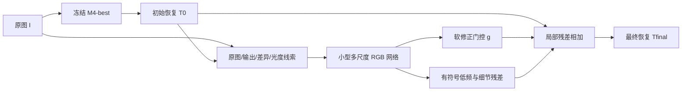

# M5：保留 M4 结构恢复能力的残余反射修正方案

> 2026-10-03 后续修订：完整历史调查与当前首选结构见 [从 M1 到 M4 的证据与像素恢复设计](M1_TO_M4_EVIDENCE_AND_PIXEL_RESTORATION.md)。本页保留为初稿。正式门控改为“修正候选相对保留基础输出的实际收益”，本页第 6.1 节的高误差 gate 标签只保留为早期对照；同时增加金字塔频带结构与全权重来历的场景隔离审计。

日期：2026-10-03。状态：设计稿；尚未实现、训练或评测 M5。代码分支：`design/m5-residual-refinement`。

## 1. 决策与适用范围

首选路线是 **冻结 M4-best，增加一个读取原图与 M4 输出的小型像素残差网络**。它学习修正剩余亮斑、光幕、颜色与局部纹理误差，原有 DiT、VAE 和 Transmission LoRA 都不再更新。第一版不新增 Qwen 教师、不重算 Q20 缓存，也不需要新的大模型权重。

二次大模型处理保留为低成本验证的对照：既测试 `WindowSeat(M4(I))`，也测试 `WindowSeat(I)` 与 `M4(I)` 的互补性。更值得优先验证的是后者，因为官方 WindowSeat 已在样本 47 上给出了更好的结果；这还不能证明它对 M4 输出进行第二次处理也会更好。

这里的“像素级指标恢复模块”是**通过 GT 监督学习的像素修正网络**。部署时没有 GT，无法直接计算真实 PSNR/SSIM 来选择结果；亮度、饱和度或无参考质量分数也不能单独决定某处是不是反射。

M5 第一版主要解决已有内容上的残余污染。对于输入中已经饱和、遮蔽或没有观测到的实际纹理，单幅输入不能保证精确恢复；不能把生成出来的合理纹理当成已经恢复的事实。

## 2. 本次查验的证据

已查看 `runs/real20_windowseat_m4/panels/22.png` 和 `47.png`，读取同目录 `metrics.csv`，核对 M4 规范文档、最终配置、推理代码与 WindowSeat 分块代码。

### 2.1 两个诊断样本

| real20 编号 | 模型 | PSNR ↑ | SSIM ↑ | L1 ↓ |
|---|---|---:|---:|---:|
| 22 | 输入 | 18.0906 | 0.689206 | 0.082477 |
| 22 | 原生 WindowSeat | 24.4394 | 0.851071 | 0.032322 |
| 22 | M0-best | 24.9905 | 0.845291 | 0.031967 |
| 22 | M4-best | **26.8950** | **0.855439** | **0.029988** |
| 47 | 输入 | 14.9542 | 0.759306 | 0.110000 |
| 47 | 原生 WindowSeat | **29.7339** | **0.879275** | **0.024148** |
| 47 | M0-best | 27.3008 | 0.868607 | 0.032281 |
| 47 | M4-best | 26.0202 | 0.863619 | 0.037802 |

22：M4 明显压低了汽车反射，相对原生 WindowSeat 的 PSNR 增加 2.4556 dB。47：三种模型都去除了大量反射，但 M4 仍有可见的亮斑、光幕残留，相对原生 WindowSeat 的 PSNR 下降 3.7136 dB。因此 47 是“残余反射更明显”，并不是完全没有去反射。

“M4 对明确物体反射更强、对无形状光幕更弱”是合理的工作假设。两张图不足以证明这是语义机制的因果效果，还可能涉及光度变化、数据分布、分块尺度与保持损失。

### 2.2 整体结果不能忽略

| real20 全部 20 张，逐图宏平均 | L1 ↓ | PSNR ↑ | SSIM ↑ |
|---|---:|---:|---:|
| 原生 WindowSeat | **0.032714** | **27.1227** | **0.846409** |
| M0-best | 0.037524 | 26.0971 | 0.829561 |
| M4-best | 0.040727 | 25.5103 | 0.819521 |

M4 在 real20 上整体落后原生 WindowSeat。它在自己的纠正标签封存测试集上超过 M0，这说明优势依赖数据分布。新的方案必须兼顾“保留 22 的收益”和“改善 47 的残留”，不能只展示挑选的成功图。

### 2.3 当前模型身份

- M4 权重：`runs/m4_best_newcache_e20_p4/best_transmission_lora.safetensors`。
- SHA-256：`897282b1bb9cfe61f96530df72edcf8a44a066bb819a3663e9100862aefdb2a3`。
- 基础模型：Qwen-Image-Edit-2509；WindowSeat 的一次 flow 更新和冻结 VAE。
- 多层 Qwen 监督只在训练中使用，推理时不会读取缓存门控或 GT。
- M4 详细来历与损失：[`M4_BEST_MODEL_REPORT.md`](../M4branch/M4_BEST_MODEL_REPORT.md)。

## 3. 为什么可能失效：区分事实与假设

**位置权重可能漏掉弱语义的光度污染。** 晚层输入/GT 差异不是物理反射概率。如果某处差异在所选表示中不突出，低门控区域的 keep 项可能把弱残余当成应该保留的输入内容。这是根据现有损失结构提出的解释，尚无逐区域消融证明。

**像素损失已有，但没有独立的残余修正能力。** M4 包含 L1、SSIM、edge 和加权 Charbonnier，不能说当前缺少像素监督。它们要通过大模型 LoRA 和 VAE 路径共同实现恢复。增加像素模块的价值在于让小网络直接拟合 M4 的剩余误差，而不是简单再加一个相似的 loss。

**VAE 与尺度可能限制细节，但不能据此把 47 全归因于 VAE。** 查验的官方推理会把每个 tile 缩放至 processing resolution，再恢复尺寸并拼接。测试输出为原始尺寸，不代表网络内部始终处理原始像素密度。新模块在 RGB 空间工作可避开额外一次 VAE 编解码，但仍需检验尺度泛化。

**长训练历史可能改变官方先验。** M4 经 Stage 2、M4 第一轮与新缓存续训，而官方模型在 real20 上平均更好。继续训练同一个 LoRA，或反复“重新缓存—自蒸馏”，未必能恢复丢失的泛化能力。

本设计不把“层没选对”作为唯一原因；先测试输出层面的互补性与剩余误差是否可被小网络学到。

## 4. 两条路线如何选择

| 路线 | 所需训练 | 可能收益 | 主要限制 | 角色 |
|---|---|---|---|---|
| M4 再处理自己的输出 | 无 | 继续压低某些残留 | 清晰内容可能被再次编辑，输入分布不同 | 二次处理基线 |
| WindowSeat 处理 M4 输出 | 无 | 不同先验处理剩余污染 | 47 的单次优势不能保证级联优势 | 二次处理基线 |
| M4 与 WindowSeat 分别处理原图 | 可先无训练 | 22/47 已有互补证据 | 两次大模型前向；简单平均可能把汽车重新混回来 | 互补性诊断及可选扩展 |
| 冻结 M4 + 像素残差网络 | 小网络 | 保留主体结构，直接修正光度与纹理误差 | 144 场景少，可能过拟合与误删真实高光 | **首选最小训练方案** |
| 冻结双候选 + 学习局部路由 + 残差 | 小网络 | 利用两个模型的局部优势 | 推理约增加一次大模型调用，训练更复杂 | 前一版不足时再加入 |

不采用“检测到高亮就减去”：真实灯光、白墙、窗外天空与物体高光都可能高亮。也不直接复制原图高频：它会把清晰的汽车轮廓、树叶等反射重新带回来。

## 5. M5-R：最小像素残差网络

### 5.1 数据流与可训练部分



M4 输出定义为：

$$
T_0=F_{M4}(I)
$$

小网络输入为 12 个通道：原图 RGB、M4 输出 RGB、二者有符号差异 RGB、输出亮度、原图近饱和程度、输出亮度梯度幅值。

$$
C=\operatorname{concat}\left[I,T_0,I-T_0,Y(T_0),\operatorname{sat}(I),|\nabla Y(T_0)|\right]
$$

其中亮度采用固定 RGB 加权；近饱和程度由最大 RGB 通道经固定平滑阈值映射得到。它们是输入线索，不能作为自动删除蒙版。`I-T0` 只称为编辑差异，不称为真实反射层，JPEG 色调、吸收与曝光使简单相减不具备物理等价性。

建议首版使用 NAFNet 风格的小型 U-Net：width 32，三次下采样，通道 32/64/128/256，每尺度两个块；LayerNorm，不使用依赖全局 batch 统计的 BatchNorm。NAFNet 是高效 RGB 恢复骨架的参考，原论文的去噪/去模糊效果不构成此处去反射收益的保证。最终参数量与显存必须由实现统计，不预先声称固定数字。

输出包含低频残差、细节残差和软门控。低频头来自最粗尺度，细节头来自最终 RGB 分辨率；二者相加后统一限制幅度：

$$
\Delta=a\tanh\left(\operatorname{up}(\Delta_{low})+\Delta_{detail}\right),\qquad g=\sigma(z_g)
$$

$$
T_{raw}=T_0+g\odot\Delta,\qquad T_{final}=\operatorname{clip}(T_{raw},0,1)
$$

初始建议幅度上限为 0.20，验证集可比较 0.10/0.20/0.30。残差必须允许正、负两个方向：单纯减亮会伤害真实高光，也无法补偿颜色和吸收导致的偏差。这个上限是稳定性约束，存在限制大幅修正的代价，应记录触及幅度上限的比例。

残差头最后一层初始化为零，使初始输出等于 M4；gate bias 初始设为 -2，使门控约为 0.119，并通过监督避免永久关闭。门控表达“当前 M4 输出哪里需要修正”，不宣称是精确反射分割。

训练的重建项作用于未裁剪的 `Traw`，避免超出范围后裁剪截断纠错梯度；验证和部署则裁剪并保存为 8 位 PNG，另外记录越界比例。

### 5.2 全局光幕与高分辨率

只看小 patch 容易把大范围光幕误认为正常曝光。保留整图低分辨率上下文；首版训练直接使用现有保比例处理图，一张图完整送入网络，动态尺寸在边缘 pad 到 8 的倍数，输出去掉 pad，不拉伸比例。

原始高分辨率推理若整图显存不足：增加一个短边保持比例、最长边不超过 256 的整图 context 分支，输出空间 context 特征，再供每个 512/768 像素局部 tile 使用。各 tile 必须共享同一全局 context；64 像素重叠、羽化融合只用于局部残差，不能把每个 patch 当成独立曝光场景。此 context 扩展属于高分辨率版本，必须单独消融，不能默认视作首版已实现。

首版在现有处理分辨率训练、在 real20 原尺寸运行可能有尺度分布差异。若验证出现这类问题，应在训练 split 的可用原始图上生成同尺度 M4 输出并联合训练。不能把低分辨率网络在原始像素上出现的退化直接归咎于语义表示。

## 6. 拟合什么：直接监督“剩余误差”

### 6.1 训练目标与软门控

训练集有配对 GT，因此有明确的有符号修正目标：

$$
\Delta^*=GT-T_0
$$

训练期计算 M4 的局部误差，并做小范围平滑：

$$
e(x)=\mathcal G_{\sigma=2}\left(\frac{1}{3}\sum_c|T_{0,c}(x)-GT_c(x)|\right)
$$

门控软目标为：

$$
g^*(x)=\operatorname{clip}\left(\frac{e(x)-\epsilon}{\tau},0,1\right)
$$

首轮候选值是 epsilon=2/255、tau=12/255。它们仅为像素标度初值，需由训练/验证数据确认，不能用 22、47 或封存测试挑选。保持绝对阈值，不逐图强制归一化到最大值 1，否则一张已经恢复得很好的图也会被要求大面积修改。

低误差区保持权重定义为：

$$
m_{keep}(x)=1-g^*(x)
$$

GT 仅用来构建训练标签。测试时 gate 必须由网络从 `I,T0` 推断；不能读取 `GT`、`g*`、Qwen 的输入/GT 差异或 DoLP。

### 6.2 首轮固定损失

定义 Charbonnier：

$$
\rho(z)=\sqrt{z^2+10^{-6}}
$$

基础 RGB 重建、结构与梯度损失为：

$$
L_{rgb}=\operatorname{mean}\rho(T_{raw}-GT)
$$

$$
L_{struct}=1-\operatorname{SSIM}(T_{raw},GT)
$$

$$
L_{edge}=\frac12\operatorname{mean}\rho(\nabla_xT_{raw}-\nabla_xGT)+\frac12\operatorname{mean}\rho(\nabla_yT_{raw}-\nabla_yGT)
$$

低频项用两个固定尺度的高斯低通，强调亮度与颜色污染而不把所有高亮都当作反射：

$$
L_{low}=\frac12\sum_{\sigma\in\{3,9\}}\operatorname{mean}\rho\left(\mathcal G_\sigma(T_{raw})-\mathcal G_\sigma(GT)\right)
$$

保持项、门控项与修正边界项为：

$$
L_{keep}=\frac{\sum_{x,c}m_{keep}(x)|T_{raw,c}(x)-T_{0,c}(x)|}{3\sum_xm_{keep}(x)+10^{-6}}
$$

$$
L_{gate}=\operatorname{mean}\operatorname{BCEWithLogits}(z_g,g^*)
$$

$$
L_{smooth}=\operatorname{mean}|\nabla(g\odot\Delta)|
$$

$$
L_{range}=\operatorname{mean}\left[\operatorname{ReLU}(-T_{raw})+\operatorname{ReLU}(T_{raw}-1)\right]
$$

建议第一版总目标：

$$
L=L_{rgb}+0.2L_{struct}+0.1L_{edge}+0.2L_{low}+0.05L_{keep}+0.01L_{gate}+0.001L_{smooth}+0.01L_{range}
$$

这些是首轮候选系数，尚无实验支持其最优性。TV 系数很小，防止修正边界接缝；过大可能涂抹纹理，应在消融中去掉检验。`Lkeep` 对准已经较好的 M4 输出，且系数弱于重建；不再以受污染原图作为统一保持目标。

首轮不加 Qwen/DINO 特征损失或 GAN，以便先确认像素修正本身是否有效。每个项记录原始值、加权值，每 20 次优化更新记录其对残差输出的梯度范数及与 RGB 梯度的余弦方向。输出梯度比例是诊断量，并不等于参数空间梯度比例；发现某项持续压过 RGB 后再按验证结果调整，不预设沿用 M4 的 8% 控制器。

PSNR 与均方误差对应，可以增加 `LMSE` 消融，但不直接堆叠“PSNR loss”来声称精确恢复。只追逐 PSNR 可能通过过平滑获得数值收益，因此仍要看 SSIM、LPIPS、文字笔画和局部误差。

### 6.3 配对质量是前置条件

GT 与输入可能有曝光、偏振滤镜颜色、轻微对齐或残留反射差异。检查训练样本的静态边缘对齐与低污染区色差，标记明显错误配对。不得自动对 GT 做局部色调“修复”来迎合模型，也不得用测试 GT 自动校正预测。误差门控是恢复监督，包含这些因素时不能称为反射真值。

## 7. 可选扩展：原生 WindowSeat 提供互补候选

若 M5-R 在大范围残留上仍不足，再计算原图的官方输出：

$$
T_w=F_{WindowSeat}(I)
$$

冻结两个候选，先训练软路由，然后接受限残差：

$$
T_{mix}=(1-h)\odot T_0+h\odot T_w
$$

$$
T_{final}=\operatorname{clip}\left(T_{mix}+g\odot\Delta,0,1\right)
$$

路由网络读取 `I,T0,Tw,Tw-T0` 及光度线索。训练期的软标签可由同尺度、经平滑的候选 GT 误差差构造：

$$
h^*(x)=\sigma\left(\frac{e_0(x)-e_w(x)}{t}\right)
$$

误差相近区域不强制选择任何候选；默认回退 M4。标签仅在训练中使用，推理不允许计算真实候选误差。不能因“22 选 M4、47 选官方”编写测试编号路由。

在验证集计算“逐像素按 GT 选择两候选”的 oracle，只用于判断互补性潜力。这是已给定两候选逐像素 RGB L1/MSE 的诊断下界，不是完整模型上界，也不是可部署算法；不能把 oracle 指标放进正式方法排名。

## 8. 二次处理的正确实验设计

二次处理只做一次额外前向，保留原始输入和第一轮输出：

$$
T_{mm}=F_{M4}(T_0),\qquad T_{wm}=F_{WindowSeat}(T_0)
$$

先在训练/验证样本检查四类区域：残余光幕、已去除物体反射、真实高光、文字与细纹理。若平均改善却把已正确内容改坏，则需要学习 gate/route，不能直接采用全图级联或无限迭代。

输出再次明显变化不等于恢复更好。模型第二轮看到的输入已不同于其通常训练分布，还经过一次 VAE 编解码。首选不把两次输出之间的差异自动当成“第二轮反射图”。

用同样的分块、随机策略和保存后指标评价；现有官方 VAE encode 使用 posterior sample，需逐样本固定种子并记录处理顺序。若改为 posterior mode，所有对照都须重新生成并明确标记，不能与现有 sampled-VAE 表直接混算。

## 9. 数据、缓存与训练计划

### 9.1 数据划分与缓存

复用纠正标签后的 `datasets/rmagnet_m2_aspect/manifest.json`，144/18/18 分组划分保持不变。manifest SHA-256 为 `9b329cb62121ce92972e70254e4d5b45545e8178f63883a7b3478e7a39c115ce`。

首版只需要离线生成训练/验证集 M4 的 RGB 输出，共 162 张。复用已有预测前必须逐项匹配权重哈希、输入哈希、尺寸、VAE采样策略、种子、分块方法与色彩范围；单次 `validation/step_*` 不自动等价于官方 real20 推理流程。缓存 manifest 记录这些字段及输出哈希，不能仅凭同名复用。

`data_cache/m5_rgb_v1/` 只放 `train/m4/`、`validation/m4/` 与 manifest。训练用 FP16 `[0,1]` RGB 或 float 残差，避免重复 JPEG 有损压缩；门控标签可以按需从缓存和 GT 计算，无需缓存 Qwen 特征。可选双候选路线再加 WindowSeat RGB 缓存。

GT、输入、输出的翻转/裁剪必须同步；保留拍摄场景分组，同一场景的 patch 不能横跨训练/验证/测试。DoLP、P90 不作为首版必要输入，后续只能单独添加消融。

### 9.2 正式实现前的阶段

| 阶段 | 内容 | 必须交付的证据 |
|---|---|---|
| D0：不训练诊断 | 验证集单次/双次处理、双候选互补性 | 同口径逐图指标、失败区域与纹理变化 |
| D1：RGB缓存 | 144 train、18 validation 的固定 M4 输出 | 完整配对、manifest、有限值、尺寸与哈希 |
| D2：短流程验证 | 小网络梯度、动态尺寸、零初始化恒等、一次保存加载 | 冻结 M4 无梯度、残差头更新、PNG与指标成功 |
| D3：同预算训练 | 先 5 epoch，观察方向，再最多 30 epoch | 验证曲线、实际updates、耗时、显存与修正幅度 |
| D4：固定后测试 | 封存18张与real20全部20张 | 全部逐图指标、宏平均、失败比例与面板 |

本文只完成设计与提交，不启动上述实验。

### 9.3 训练初始配置

建议 AdamW，学习率 `1e-4`，weight decay `1e-4`，BF16，gradient clip 1.0，cosine，前 5% 更新 warmup。四卡每卡 batch=1，梯度累积=1，有效 batch=4；只训练小网络，Qwen 不常驻训练显存。

144 张训练图对应每 epoch 36 次更新。5/10/30 epoch 分别为 180/360/1080 次更新。按完整场景遍历计 epoch，随机 patch 不能人为宣称扩大独立场景数量。后续若 batch 改变，实际 updates 应重新计算并记录。

每 epoch 验证，验证 RGB L1 为选 best 的主指标；同时跟踪 PSNR/SSIM/LPIPS。最多 30 epoch、连续 4 epoch 无改善早停，至少完成 5 epoch。只保留 best/latest 小网络参数，不需要保存大模型副本；冻结的 M4-best 始终使用同一份权重。

## 10. 最小消融与评价约束

| 编号 | 内容 | 回答的问题 |
|---|---|---|
| R0 | 固定 M4-best | 当前基线 |
| R1 | `I+T0`，无 gate 的受限残差 | 小 RGB 网络是否已经足够 |
| R2 | R1 + gate/keep/低频项 | 是否减少已正确区域的破坏并压低光幕 |
| R3（按需） | 去掉 gate 或 low 项的同预算消融 | 收益来自位置选择还是光度监督 |
| E1（按需） | 官方原图候选 + 局部路由 | 双专家互补是否值得额外成本 |

R1/R2 使用相同初始化规则、训练场景、epoch、全局 batch、学习率与随机种子。不能用 22/47 单独调阈值后声称泛化。

指标统一在保存后的 8 位 RGB PNG 上计算，原生分辨率/处理分辨率分别标记。汇总逐图宏平均，并给出逐图差值、胜出数量和最差退化。GT 仅用于离线评价。

将“残余光幕/亮斑”“明确物体反射”“低污染文字/纹理”“真实高光”作为诊断分组。局部 ROI 要先固定，不能针对某方法挑选；局部结果与整图指标一起报告，避免仅靠全图变暗提高分数。比较 GT 高光区域的颜色、亮度与边缘，检查是否把真实灯光当成污染。

18 张封存测试和 real20 已经被查看，且此次方案受到 22/47 的启发，因此后续对它们的改善属于既有测试上的回顾性评估。模型和系数只用原训练/验证选择；若要给出新的泛化结论，需要额外未参与设计的新场景测试集。

放行条件：验证平均重建优于固定 M4、SSIM/LPIPS没有系统性退化，已正确区域与真实高光的破坏未增加；随后报告所有测试结果。若只改善47式样本，却让22式结构恢复或文字显著退化，不能默认替换 M4，转向门控/路由或回退基线。

## 11. 资源预算与实现接口

离线生成 RGB 缓存时，沿用现有 4-bit Qwen + 单卡 M4 推理，顺序处理；可按样本在不同 GPU 分摊，单卡不同时加载两个 Qwen。训练期只读缓存并加载小网络，四张24GB卡无需共享大模型显存。两候选路线可在同一 Qwen 上顺序换 LoRA，但实现必须检查旧adapter与状态，不能把M4和官方权重叠加；重新加载同一设备顺序推理是更容易核对的备选。

FP16 RGB 缓存的原始数组空间为：

$$
S_{cache}=\sum_{i=1}^{N}H_iW_i\times3\times2\ \text{bytes}
$$

若 162 张平均为 20万像素，一套约 185 MiB；双候选约370 MiB，不含manifest、预览及文件头。这只是按尺寸估算，生成前从manifest精确求和。参数与checkpoint空间为：

$$
S_{weights}=P\times b
$$

其中 P 是小网络参数量，b 为保存dtype每参数字节；best/latest两份乘2。实现后统计实际参数量与峰值显存，不复制Qwen/WindowSeat/M4大权重，也不占Docker Images。

建议将来新增以下文件，本文不代表这些文件已经存在：

```text
src/rmagnet/m5_rgb_cache.py       # 固定模型RGB缓存与manifest
src/rmagnet/m5_refiner.py         # RGB残差、低频头、gate
src/rmagnet/m5_losses.py          # 重建/保持/门控/低频损失
src/rmagnet/m5_train.py           # 缓存训练、早停、best/latest
src/rmagnet/m5_eval.py            # 原尺寸推理与统一保存后评价
scripts/prepare_m5_rgb.sh
scripts/train_m5_refiner.sh
scripts/eval_m5_refiner.sh
configs/m5_refiner.yaml
runs/m5/<run_name>/
```

API 最小契约：`refiner(I,T0)` 返回 `raw_prediction`、`prediction`、`gate`、`delta_low`、`delta_detail`。输入为 `[B,3,H,W]`、RGB `[0,1]`、同尺寸；predict必须支持batch1动态空间尺寸。冻结模块、标签生成与evaluation明确分开，forward不能要求GT。

## 12. 与现有 M4 文档的关系

M4-best仍是本方案冻结的基础恢复器。M4规范文档关于自身封存测试上的收益保留，但“当前更好的最终权重”必须限定在当时的自有数据对比，不能外推为real20上的总体最好。

M5目标不是以PSNR替代结构恢复，而是单独拟合可观测的剩余误差，检验是否能在保留M4成功恢复的同时改善亮斑与光度残留。如果像素网络没有学到跨场景规律，正确的后续方向是补充这类训练场景或引入互补候选，而不是无限加深级联。

## 13. 相关原始材料与外部参考

项目材料：`runs/real20_windowseat_m4/metrics.csv`、`summary.json`、`panels/22.png`、`panels/47.png`；`src/rmagnet/real20_infer.py`、`real20_report.py`；`src/rmagnet/m4_train.py`；M4最终 `run_config.json`。RAGNet数据提交：`75467a50dcbf1558dbb6b7b70cdcbefc78a4d242`。

外部参考只支持结构选择的合理性，不构成M5有效的实验结论：

- [WindowSeat官方仓库](https://github.com/huawei-bayerlab/windowseat-reflection-removal)：官方单图推理与短边分块入口；本项目实际固定版本以M4规范文档为准。
- [Simple Baselines for Image Restoration，ECCV 2022](https://www.ecva.net/papers/eccv_2022/papers_ECCV/papers/136670017.pdf)：NAFNet风格轻量RGB恢复骨架的来源。
- [Location-Aware Single Image Reflection Removal，ICCV 2021](https://openaccess.thecvf.com/content/ICCV2021/html/Dong_Location-Aware_Single_Image_Reflection_Removal_ICCV_2021_paper.html)：反射位置置信度用于控制恢复的相关先例；其置信度不等于本方案的M4误差gate。
- [Single Image Reflection Removal Through Cascaded Refinement，CVPR 2020](https://openaccess.thecvf.com/content_CVPR_2020/html/Li_Single_Image_Reflection_Removal_Through_Cascaded_Refinement_CVPR_2020_paper.html)：有训练与状态传递的级联恢复先例，不能据此推断直接重复调用固定大模型一定改善。
- [Single Image Reflection Removal With Absorption Effect，CVPR 2021](https://openaccess.thecvf.com/content/CVPR2021/html/Zheng_Single_Image_Reflection_Removal_With_Absorption_Effect_CVPR_2021_paper.html)：提醒强度失真与反射消除需要共同考虑，简单亮度相减不是完整图像形成模型。
