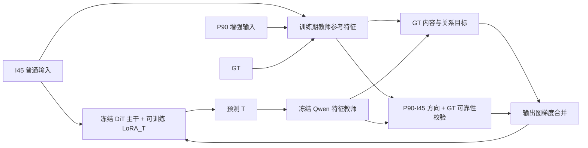

# M6：用偏振增强方向惩罚语义残留

日期：2026-10-10。状态：**设计完成，尚未实现训练器、生成缓存或训练**。

## 1. 要验证的问题

M4 已用 GT 告诉生成模型“恢复后应接近什么”。M6 增加一个训练期问题：**同一场景从普通输入 I45 到增强反射 P90，哪些特征朝反射增强的方向变化？生成结果里是否还残留这种方向的变化？**

两个信号一起使用：

- I45 / GT：提供正确恢复目标，约束真实内容、像素和结构。
- P90 / I45：提供候选干扰方向；经 GT 校验后，用于惩罚生成结果中的残留。

P90 不是整张“纯反射层”。偏振旋转也会改变透射光、曝光、颜色以及可见细节，所以不能把它的全部特征直接当负样本。M6 是检验这一假设的实验，不预设它一定优于 M4。

**本轮仅设计。** 没有启动缓存、训练、评测或新的 GPU 进程。

## 2. 分支、模型起点与数据

| 项目 | 本次锁定内容 |
|---|---|
| 分支 | `experiment/m6-polar-negative` |
| 独立代码目录 | `/share/linmingheng-local/xuke/RMagNet-M6` |
| 代码基点 | main：`c5ee1b71e976f4e4fc93835e4dfb37344f8307c3` |
| 生成模型起点 | **M4 initial best**，即第一轮 M4 best，step 612 |
| 初始化文件 | `/share/linmingheng-local/xuke/RMagNet/runs/m4_e30_p4/best_transmission_lora.safetensors` |
| 实际核验 SHA-256 | `5725d32b04e1271d51a33f7512174f1035ff0acf5e5427bdd3b179e98e1a13eb` |
| 原训练代码提交 | `aa40c9854656996d4d47a20fe8ce17d4e89713c9` |
| 基础模型 | Qwen-Image-Edit-2509 + WindowSeat Transmission LoRA |
| 本实验数据 | `/share/linmingheng-local/xuke/datasets/rmagnet_sma_dataset3` |
| 数据 manifest SHA-256 | `bb211d1de9d399c685d70e80ef292d9a86b9e6733fb78cf1c1724d0d591bb77c` |
| 当前划分 | 204 train / 25 validation / 24 test；按拍摄组划分、保留既有划分 |

M4 initial 在此明确指第一轮训练的 best，不是 Stage 2 best，也不是 SHA 为 `897282b1...` 的 M4 final best。所有对照都从同一个 M4 initial 文件重新开始。

按 manifest 的角色读取 I / GT / P90，**不能重新按文件后缀猜标签**。旧批次修正标签后，无后缀与 `_GT` 的历史文件名存在反向含义；当前 manifest 已记录正确角色。后续新数据使用的正常命名不改变旧批次的解释。

当前留存的 `m4_multilayer_v1/manifest.json` 已随过滤保留 108 个训练样本，不能当作完整 204 张缓存。它的教师为关闭全部 LoRA 的 Qwen。将这些样本与过滤记录中的 36 个历史训练样本合并，得到 M4 的 144 张训练清单；与当前验证/测试清单比较，没有 ID 或拍摄组交叉。**Stage 2 的完整拍摄组训练历史仍未审计**，实施前需补查，不能把本次部分审计表述成全部初始化历史无泄漏。

当前测试集和 real20 已被多次查看。后续分数属于既有测试上的回顾性比较；本轮模型选择只使用验证集，不能据此宣称全新独立测试上的收益。

## 3. 对 M4 的两项澄清

### 3.1 读取的是 block 特征，不是 attention 概率

实际源码用 forward hook 读取 Qwen block 的 `output[1]`，形状为图像 token × 3072，是注意力和前馈等运算后的隐藏表示。历史“注意力热点图”是对这些特征做余弦差异得到的可视化，不是 softmax attention 矩阵，也不能仅靠热点证明它是纯语义层。

M6 保留这个特征定义。中层固定 Q37 / Q39 / Q41，代码索引 36 / 38 / 40，使用完整特征向量。无需改 attention processor、保存 token×token 矩阵或重新筛层。

### 3.2 输入差异本身没有生成模型梯度

若教师冻结，下面的值对待训练 LoRA 是常数：

$$
d\big(Q_l(P90),Q_l(I45)\big)
$$

单独把这个值加进 loss，不会引导生成。有效的惩罚必须包含当前预测的特征：

$$
Q_l\big(F_\theta(I45)\big)
$$

输入对的差异负责定义“惩罚哪个方向”，预测结果负责产生可训练的误差信号。

## 4. 总体路径：只通过 loss 引导

不增加输入通道、语义记忆模块、可训练教师或细节修复网络。继续使用 WindowSeat 的一次 flow 编辑，训练 LoRA_T，冻结 DiT 主干和 VAE 参数。P90 分支继续用于 M4 已有的重建和 `L_polar`。

推理仍只输入 I45；P90、GT、方向特征和门控均为训练监督，推理时不读取。缓存如果后续实现，也只能离线生成训练参考，不能参与编辑前向的条件输入。

## 5. 教师与特征空间

### 5.1 使用一致的冻结教师

M6 默认参考和在线预测都**关闭全部 LoRA**提取 Qwen 特征：

- 固定 Qwen revision `d3968ef930e841f4c73640fb8afa3b306a78167e`。
- 固定文本条件、确定性 VAE posterior mode、flow timestep 499。
- I45、GT、P90 和预测使用完全相同的缩放、网格、文本与 timestep。
- 教师参数冻结，但预测到教师的计算图必须保留；冻结参数不等于 `no_grad`。

生成前向启用待训练 LoRA；教师前向及其 VJP / checkpoint 重算期间关闭 LoRA，完成反向后再恢复，避免共享模型的 adapter 状态切换破坏重算。

这与 M4 initial 的原始关闭 LoRA 教师一致。不能混用后来启用 M4 best LoRA 生成的缓存；若未来实验更换教师，必须把所有参考及预测统一，并单独记实验。

### 5.2 中心化、归一化

对每层、每张图，先减去图像 token 均值，再按通道 L2 归一化：

$$
Z_l(X)_x=
\frac{Q_l(X)_x-\operatorname{mean}_{u}Q_l(X)_u}
{\max\left(\left\|Q_l(X)_x-\operatorname{mean}_{u}Q_l(X)_u\right\|_2,\epsilon\right)}
$$

归一化前范数过小的 token 标为无效。差分、点积、loss 和梯度控制用 FP32；参考可保存 BF16。

中心化减弱全局光度偏移，但不能保证消除局部曝光、白平衡或饱和干扰。它保留的是 Qwen 表示中的候选方向，不是已分离的物理反射层。

## 6. 候选反射方向及可靠性

### 6.1 方向来自 P90 与普通输入

对中层集合中的每一层：

$$
\mathcal L_m=\{37,39,41\}
$$

$$
\Delta_l^{p}(x)=Z_l(P90)_x-Z_l(I45)_x
$$

$$
U_l(x)=\frac{\Delta_l^{p}(x)}{\max(\|\Delta_l^{p}(x)\|_2,\epsilon)}
$$

U 表示“从普通输入到增强反射时，特征变化的方向”。热图的差异幅度丢失正负方向，所以只做热图重加权不足以表达本实验的惩罚。

### 6.2 GT 检验它是否对应应去除的内容

$$
\Delta_l^{g}(x)=Z_l(I45)_x-Z_l(GT)_x
$$

$$
a_l(x)=\cos\big(\Delta_l^{p}(x),\Delta_l^{g}(x)\big)
$$

若两个方向一致，意味着“偏振增强的变化”与“输入相对 GT 多出来的变化”在该特征层同向，这才是适合惩罚的候选。

若 P90 在某处反而削弱反射、改变真实物体颜色或产生错位，两向量可能相反或无关，此处不启用新的负方向惩罚，继续依靠原有 GT 重建。

拟定软置信度：

$$
C_l^{p}(x)=\operatorname{clip}\left(\frac{a_l(x)-0.2}{0.6},0,1\right)
$$

拟定稳定性条件：两种差分范数均至少 0.02，归一化前特征有效、图像配准有效，并排除参考图中明显饱和 token。首版按 token 对应 RGB 区域统计，三张参考图中任一张有超过 10% 像素的任一通道达到 250/255，该 token 不参与新增惩罚。配准沿用现有质量排除记录并审阅训练预览，不新增自动光流配准；新发现错位的区域必须标为无效。以上是首版可配置阈值，不是已经测定的最佳值。不得按测试集效果反复调它们。

三层至少两层通过方向一致性和范数条件，才允许该位置参与。各层的特征空间不同，不直接比较跨层 U 的通道向量夹角。

设 B 为三层通过数量达到两层的指示量，V 为有效性 mask，G 为 M4 原有晚层 I45 / GT 变化门控：

$$
M_l(x)=\operatorname{sg}\left[G(x)\,B(x)\,V_l(x)\,C_l^{p}(x)\right]
$$

G 仍使用 Q52 / Q54 / Q56 的既有公式，不引入 DoLP。M、U 和全部参考目标均 stop-gradient。

实施时若一张图的平均置信度质量不足 1%，跳过该图的新增惩罚并记录。各层没有有效质量时同样跳过；不得用每图百分位强行挑一部分位置，更不得把无效方向除以极小数后放大。基准统计图应同时展示候选范数、方向一致性、饱和区与最终 M。

## 7. 新惩罚：只惩罚相对 GT 的反射方向残留

普通输入输出为：

$$
\hat T_I=F_\theta(I45)
$$

预测相对 GT 在候选方向上的残差：

$$
r_l(x)=\left\langle Z_l(\hat T_I)_x-Z_l(GT)_x,\operatorname{sg}(U_l(x))\right\rangle
$$

新损失为：

$$
L_{\mathrm{polar\_neg}}=
\operatorname{mean}_{l\in\mathcal L_{\mathrm{valid}}}
\frac{\sum_x M_l(x)\left[\max(0,r_l(x))\right]^2}
{\sum_x M_l(x)+\epsilon}
$$

如果有效层集合为空，返回与预测相连的零标量，并跳过该项梯度控制。

**为何以 GT 为零点？** 某些真实 transmission 纹理也可能沿 U 有分量。惩罚的是预测超过 GT 的部分，而不是把输出中的 U 分量全部消灭。

投影空间中的简单例子：GT=0，普通输入=1，P90=2，候选增强方向为正；输出=0.3 时惩罚 0.09，输出=0 时惩罚 0。输出=-0.3 时该项也为零，所以它只负责抑制残留，过度去除必须由 GT 重建和正向内容损失约束。

该形式的 token 梯度沿候选 U 反方向，并经冻结教师和 VAE 回传到输出，再回传到编辑 LoRA。Qwen 有全局注意力、特征还使用 token 均值中心化，因此 token mask 限制的是监督位置，**不保证输出像素梯度只在同一局部区域内**。

首版只在普通输入输出上计算新项。P90 输出保留重建和一致性监督；不同时给两个分支加新项，以便先判断它是否改善真实部署输入的恢复。

这仍是 GT 监督中的方向选择，不构成新的独立真值。已有特征向 GT 靠近也会压低该残差；M6 的潜在收益是更明确地分配更新方向，而不是引入比 GT 更多的真实内容。

## 8. 保留的 M4 损失

单视图重建：

$$
L_{\mathrm{rec}}(T,Y)=L_1(T,Y)+0.2\big(1-\operatorname{SSIM}(T,Y)\big)+0.1L_{\mathrm{edge}}(T,Y)
$$

基础项保留普通输入、P90 两路重建和双向 stop-gradient 一致性：

$$
L_{\mathrm{base}}=
\tfrac12 L_{\mathrm{rec}}(\hat T_I,GT)
+\tfrac12 L_{\mathrm{rec}}(\hat T_{90},GT)
+0.10L_{\mathrm{polar}}
$$

$$
L_{\mathrm{polar}}=
\tfrac12 d_G\big(\hat T_I,\operatorname{sg}(\hat T_{90})\big)
+\tfrac12 d_G\big(\hat T_{90},\operatorname{sg}(\hat T_I)\big)
$$

这里的距离是以 1+G 加权的 RGB Charbonnier 距离。保留 M4 原实现的距离、归一化和分支梯度拆分。

继续保留：

- `L_spatial`：0.75 晚层门控加权的 GT 恢复 + 0.25 低响应输入保持。
- `L_texture`：Q16 / Q20，低门控位置接近 I45，高门控位置接近 GT。
- `L_sem_pos`：Q37 / Q39 / Q41，0.7 中心化内容距离 + 0.3 水平/垂直邻接关系距离。

示意总目标：

$$
L_{M6}=L_{\mathrm{base}}+lambda_s L_{\mathrm{spatial}}+lambda_t L_{\mathrm{texture}}+lambda_+ L_{\mathrm{sem\_pos}}+lambda_- L_{\mathrm{polar\_neg}}
$$

实际优化沿用 M4 输出图梯度控制，系数动态计算，不把下面的百分比当作固定 loss 系数。

## 9. 辅助梯度预算：首版不扩大总强度

| 分组 | M4 对照目标 | M6 默认目标 |
|---|---:|---:|
| 空间组 | 基础输出梯度的 8% | 8% |
| 纹理组 | 8% | 8% |
| 正向语义 | 8% | 6% |
| 新增负方向 | 0 | 2% |
| 正向 + 负方向合并上限 | 8% | 8% |
| 全部辅助合并硬上限 | 25% | 25% |

首版把原有 8% 语义预算拆为 6% 正向与 2% 负方向，防止“效果好”只是因为增加总辅助强度。语义内部合并后限幅到 8%，再与空间、纹理组合并，按原 M4 上限限幅到 25%。

每个有效分量先按基础输出梯度范数匹配目标比例，使用 EMA 0.9，再按当前范数限制到各分量目标上限。最终合并也设置硬上限。全部目标在前 36 个优化更新线性渐入。

$$
g_{+}=\nabla_{\hat T_I}L_{\mathrm{sem\_pos}},\qquad
g_{-}=\nabla_{\hat T_I}L_{\mathrm{polar\_neg}}
$$

$$
g_{\mathrm{sem}}=\operatorname{cap}_{0.08\|g_b\|}
\left(\alpha_+g_++\alpha_-g_-\right)
$$

$$
g_I=g_b+\operatorname{cap}_{0.25\|g_b\|}
\left(\alpha_sg_s+\alpha_tg_t+g_{\mathrm{sem}}\right)
$$

有效性不足或梯度为零时，新项严格为零，**不设置会强迫产生梯度的最低系数**。跳过负项时也不自动把预算转移给正向项；对照与日志明确记其有效覆盖。

除原有日志，还记录负项原始数值、实际输出梯度范数、缩放系数、各限幅前后比例、与基础/正向梯度夹角、残留正投影比例、有效 token 质量和跳过样本数。目标比例是上限与调度目标，不保证实际每步机械相加等于 24%。

## 10. 结合既有实验的边界

| 已有观察 | 对 M6 的约束 |
|---|---|
| 10% 提到 30% 的语义梯度没有稳定收益 | 本轮改变监督方向，不先提高总语义强度 |
| M3 noLrec 路线不足以替代重建锚点 | 保留 Lrec，不单靠特征惩罚训练 |
| M4 自有集结构改善，real20 平均却低于官方 | 必须同时看结构保持、反射残留和外部分布，不只挑成功图片 |
| M4 中层也响应曝光/白平衡 | 使用中心化、GT 方向校验和饱和排除；仍承认误判可能 |
| 新缓存续训的边际收益很小 | 不把反复更换教师当作本轮创新；固定关闭 LoRA 的教师 |
| P0 单输入预测稳定 mask 未通过验证 | M6 不训练推理期 mask；多视图和 GT 仅用于训练监督，不能声称已解决单图识别问题 |
| 标签曾被纠正，后续又过滤和合并数据 | 锁定 manifest 角色、哈希与拍摄组；不使用旧文件名推断或混用样本集合均值 |

原始 18 张 M4 initial、当前过滤共同 12 张、扩展阶段 21 张和最新 24 张都不是同一个集合。历史分数只作背景，M6 必须在当前固定清单上重新评测起点及其对照才能下结论。

## 11. 后续实施计划（本次不执行）

### 阶段一：静态检查与训练参考

1. 核对 204 张 I45 / GT / P90 配对、角色、尺寸、哈希、配准和拍摄组划分；核验初始化 SHA 与历史训练/评测组交叉。
2. 每张图复用其现有缩放，保持比例和动态 token 网格。所有参考共用同一网格；不追加随机裁剪或未同步增强。
3. 固定关闭 LoRA 的教师，提取中层三视图、前层 I45 / GT、晚层 I45 / GT。
4. 生成 U、方向一致性、可靠性 M 及少量训练图预览。没有足够反射增强证据的样本允许全零负权重。
5. 缓存只覆盖训练集。保存每个输入角色的哈希、教师参数/adapter/提示词/timestep、token 布局和公式版本，满足完全相同时才能复用旧特征。

建议未来目录：`/share/linmingheng-local/xuke/RMagNet-M6/data_cache/m6_polar_negative_v1/`。本次未创建。

后续不必长期保存三视图的所有中层完整特征：GT 完整特征供正向 loss，另保存每层 U 和 M 即可。I45 / P90 中层临时特征生成完方向后删除临时副本，**不删除其他实验缓存**。前层和晚层遵循原 M4 的存储需求。

以当前近 20 万像素样本、约 750 个 token、3072 通道估算，每张多保存三层 BF16 U 约 13.2 MiB，204 张约 2.6 GiB；实际按每图 token 数累加。预算公式：

$$
B_{\mathrm{extra}}=\sum_{i=1}^{204}3\,N_i\,3072\times2\ \mathrm{bytes}+B_{\mathrm{masks+metadata}}
$$

新完整缓存还包括原有 GT 和前层等内容，不能把上述增量当总空间。方向先 FP32 计算再 BF16 保存，读取后 FP32 重归一化并验证量化误差；极小差分按阈值跳过，不以高精度存储替代可靠性。

### 阶段二：流程验证

先用少量训练样本验证：GT 输出时新增项为零；朝 U 加扰动惩罚增加；背离 U 不产生该项的恢复奖励；无方向/低质量样本为零；教师及 VAE 无参数梯度；LoRA_T 有非零梯度；与 LoRA 状态切换和重算兼容；保存恢复和动态尺寸通过。

合成投影检查只能验证数学方向，不能证明真实 Qwen 特征的“语义”含义。必须另看训练参考预览，特别检查文字、透射物体、错位边缘、饱和炫光和全局光度变化。

显存策略沿用 M4 的 detached 输出叶子 + 教师 VJP + 编辑前向重算。参考放 CPU，逐层搬到 GPU；预测在线只到 Q41，共用现有教师前向，不新增 P90 在线教师图。4-bit DiT、BF16、每卡 batch 1、uv 原隔离环境；不使用 Docker、不安装驱动。

四张空闲 24GB 卡时优先四卡 DDP，有效 batch 4；当前单卡任务不由此文档触发资源抢占。正式实施前先实测显存，不把历史峰值当保证。单卡可按 batch 1、累积 4 保持有效 batch，但脚本需显式支持，不能直接启动要求四卡的旧脚本。

### 阶段三：同预算训练对照

推荐第一轮 2 epoch。当前 204 张训练图、有效 batch 4，**每 epoch 51 次更新，2 epoch 是 102 次更新，不是早期 70 次**。

| 组 | 正向语义预算 | 另一个语义预算 | 用途 |
|---|---:|---|---|
| M6-A | 8% | 无 | 同起点、同数据、同更新数继续 M4 |
| M6-B | 6% | 真实 U / M 负方向 2% | 主实验 |
| M6-W | 6% | 同 M 支持上的无方向 GT 特征误差 2% | 判断收益是否仅来自关注同一区域 |
| M6-S | 6% | 同图内联合置乱 U / M 的负方向 2% | 判断正确方向与位置是否必要 |

首批优先 A / B；W / S 是解释收益所需的消融，不在本次自动运行。置乱仅作用于训练监督 U / M，GT 特征和原图保持正确配对；同图同层固定排列保持向量集合、权重数值、支持质量和张数一致，不能重算筛选而改变对照质量。

所有组保留 P90、Lpolar、空间、纹理、教师、学习率和初始化；控制器与上限一致。建议学习率 5e-6，PagedAdamW8bit、weight decay 0.01、cosine、warmup 20 更新、梯度裁剪 1.0、seed 2026，每 epoch 验证，只留 best / latest；best 按验证保存 PNG 的宏平均 L1 选择，另报告 PSNR / SSIM / LPIPS。

若 2 epoch 没有一致方向，先核对 M 覆盖、投影和梯度冲突，再决定是否 5 epoch；不默认开长训练。继承的 old M4 脚本有写死项目目录和起点等配置，未来必须新建 M6 启动器，不能在此分支直接运行旧命令。

### 阶段四：评价与结论

验证/测试只喂普通输入，不读取其 P90 或 GT 教师缓存。指标按原尺寸、保存后的 RGB8 PNG 与 GT 计算，逐图宏平均。GT 仅用于计分；与起点、M6-A 使用相同清单和推理协议。

除全图指标，预先固定文字/细纹理、低变化保持、亮斑/光幕和真实反射区域的局部检查规则。训练 token 残留下降本身不是成功标准；必须看到生成图的残留减少且真实内容不被额外删除。real20 仅作回顾性外部分布评估，不用于选 checkpoint 或改阈值。

支持该设计的结果应是：B 相对同预算 A 改善恢复/结构，保持误差不明显恶化，且 W / S 不能解释全部收益。若只降低训练投影 loss 或只增加改写，结论是方向惩罚没有验证，而不是自动提高比例继续训练。

## 12. 未来需要修改的文件

| 建议文件 | 职责 | 本次状态 |
|---|---|---|
| `src/rmagnet/m6_cache.py` | 三视图方向、可靠性与缓存审核 | 未实现 |
| `src/rmagnet/m6_losses.py` | 方向残留损失及空支持处理 | 未实现 |
| `src/rmagnet/m6_train.py` | M4 训练流程 + 拆分语义梯度控制 | 未实现 |
| `scripts/prepare_m6.sh` | 参考准备入口与磁盘/GPU 检查 | 未实现 |
| `scripts/train_m6.sh` | 可选 epoch、GPU、恢复和 best/latest | 未实现 |
| `scripts/eval_m6.sh` | 普通输入推理与统一评测 | 未实现 |

本分支当前只增加这份设计、设计配置和只读调查材料，不提供可误启动训练的占位脚本。

## 13. 本次可复核材料

- `materials/M6_REFERENCE_AUDIT.json`：服务器实际读取的模型身份、数据计数、缓存角色和历史验证数值。
- `M6_DESIGN_CONFIG.json`：拟定参数，标记 `design_only`，不是可运行训练配置。
- M4 实际实现：原项目 `src/rmagnet/m4_train.py` 的 `semantic_loss`、`online_prediction_features` 和 `GradientController`；`src/rmagnet/m4_cache.py` 的 `selected_features`。
- 历史报告：原项目 `docx/M4branch/M4_BEST_MODEL_REPORT.md`，注意其主体描述的是 M4 final，不能用它的最终初始化路径替换本实验 M4 initial。

**当前结论：** 可把 P90 / I45 的差异用于有方向的恢复惩罚，但必须包含预测结果、以 GT 为零点，并屏蔽不可靠方向。M6 用 loss 把“应该接近什么”和“什么变化不应残留”结合，不改变单图编辑架构。
