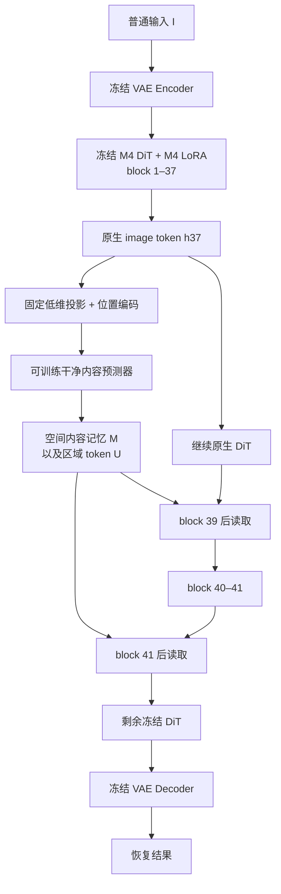

# 面向 M4 语义监督的内容记忆架构建议

日期：2026-10-08。性质：调查与架构设计，没有启动训练、下载模型或修改服务器。

## 1. 建议与研究假设

**建议在现有单个 DiT 中加入一个小型“干净内容记忆模块”：在 block 37 后预测 GT 对应的内容表示，再让 block 39、41 后的适配器读取它。** 保留空间网格和区域关系，不把内容表示压成一张热点图。暂称 Semantic Memory Adapter，简称 SMA；本名称仅指设计候选，不占用现有 M5-Pixel 实验编号。

研究假设是：显式预测并使用干净内容表示，比只在最终输出上施加语义特征损失，更容易让模型学习哪些结构属于需要保留的场景。

这是一项可证伪的假设。现有结果支持投入一个小实验，但没有证明语义模块必然带来大幅提升，也没有证明 block 37 是独有或纯粹的语义层。

## 2. 当前证据：为什么值得改结构

依据本地留存的 M4 规范报告、M1–M4 历史审计、扰动诊断及逐图指标。本次没有把本地历史副本当作服务器当前源码的实时检查。

### 2.1 M4 的语义损失约束什么

对 block 37、39、41 的输出特征，先按图像减去 token 均值，再归一化；内容项匹配预测图与 GT 的对应 token，关系项匹配水平、垂直相邻 token 的余弦相似度：

$$
L_{\mathrm{semantic,out}}=0.7L_{\mathrm{content}}+0.3L_{\mathrm{relation}}.
$$

这是有价值的内容与结构约束，但当前有三个缺口：

1. **约束主要发生在输出侧。** 模型先生成图，再用冻结 Qwen 检查生成结果；推理路径没有一个受直接监督的干净内容中间状态。
2. **关系主要是局部邻接关系。** 它能约束局部结构，不等于已经表达了远处招牌与店铺、汽车各部分之间的归属关系。
3. **特征仍混有光度信息。** 扰动实验的中层同时强烈响应对象替换、曝光和白平衡，不能把其中全部差异都解释成语义变化。

现有 LoRA 当然可能隐式学习这些能力。这里指出的是“缺少显式、可检查的中间目标”，并非声称现有模型完全没有语义处理。

### 2.2 已有实验限制了哪些路线

| 观察 | 对本方案的约束 |
|---|---|
| M1 的 R 分支拟合 P90，融合中 R 置乱没有稳定伤害结果 | P90 不作为纯反射 GT；新增模块必须检查是否被真正使用 |
| DINO/DoLP 真实位置未稳定胜过置乱，提高语义强度也无稳定收益 | 不以“更强损失”和“热图更漂亮”作为主要创新 |
| M2-B 与严格约 30% 梯度的 B1 结果接近 | 当前瓶颈不宜继续简单归因于语义梯度太弱 |
| M4 自有 18 张测试集 SSIM/L1 好于 M0，但 PSNR 未超过 M2-B | 内容结构和像素误差存在不同优化方向 |
| real20 上官方 WindowSeat 好于 M0、M4 | 新模块必须检查外部分布，不能只针对本地店铺图拟合 |

自有 18 张的同口径结果：M0-best 23.7737 dB / 0.827890；M4-best 24.0414 dB / 0.833084。real20：官方 27.1227 dB / 0.846409；M4 25.5103 dB / 0.819521。前者不能抵消后者的泛化退化。

还要保留历史数据限制：继承 Stage 2 的模型曾接触当前测试集中六张对应的早期训练场景；17 曾用于早期验证。这 18 张可继续做历史诊断，不能证明全流程未见场景的泛化。

## 3. 文献调查带来的取舍

### 3.1 原生 Qwen 的语义通路与 WindowSeat 不完全相同

原生 Qwen-Image 的编辑设计将 Qwen2.5-VL 表示与 VAE 表示共同用于条件输入；两者分别承担语义与重建线索。[Qwen-Image 技术报告](https://arxiv.org/html/2508.02324v1)

WindowSeat 使用预计算文本条件；公开推理代码读取保存的 embeddings，不逐图运行 Qwen-VL。论文叙述与当前公开代码在 latent 流细节上有差异，实现时应以项目固定版本源码为准。[WindowSeat 论文](https://arxiv.org/html/2512.05000v1)、[官方推理源码](https://github.com/huawei-bayerlab/windowseat-reflection-removal/blob/main/windowseat_inference.py)

因此，“沿用 Qwen-Image-Edit”不等于已经在调用其完整的逐图语义理解通路。不过直接补上一个大型 VL 模型也不是自动解答：它可能把混合图里的反射汽车认作应保留的场景物体。

### 3.2 可借鉴的结构机制

| 工作 | 借鉴点 | 不作出的外推 |
|---|---|---|
| [REPA](https://arxiv.org/abs/2410.06940) | 对内部表示施加明确目标，让生成模型提前形成有用表示 | 它的生成训练收益不能直接等同于小数据反射去除收益 |
| [IP-Adapter](https://arxiv.org/abs/2308.06721) | 用小型独立注意力通路读取图像条件，冻结主要生成参数 | 不直接套用其原始权重；Qwen 的 joint attention 需要专门接入 |
| [Slot Attention](https://arxiv.org/abs/2006.15055) | 用少量区域 token 汇聚长程内容关系 | 本方案区域 token 不宣称天然对应真实物体或纯 T/R 层 |
| [GenSIRR](https://arxiv.org/html/2512.06358v1) | 混合观测的表示结构本身值得修改，固定自然语言提示有局限 | 本方案不复现其 VAE 训练，也不假设非线性特征可以物理相减 |

综合判断：先在现有 DiT 内构建可监督、可读出的内容记忆，最贴近已有缓存与损失体系；大型 VL 语义编码器可以作为后续独立对照。

## 4. 推荐架构



第一轮冻结整个 M4-best，包括已有 Transmission LoRA。只训练新增内容预测器与读取适配器。这样先回答“新增表示和读取路径有没有用”；后续再考虑联合更新 LoRA。

推理只输入 I；GT、P90、DoLP 和教师缓存都不进入推理接口。

### 4.1 取同一次前向中的 image token

在 block 37 后取得当前图像 token；不额外运行另一个 DiT，也不为了构造输入记忆提前访问 block 52–56。

首版只用 block 37 生成记忆。block 39、41 用于读取与原有输出监督。这样避免“先跑完整网络拿多个层，再重新生成”的双重推理成本，也避免把未来层状态误接成当前层条件。

按运行时配置读取实际 hidden width、token 数和网格。不能沿用 512×384 时硬编码的 24×32 网格。图像 token 与文本 token 的返回顺序也必须按固定 Diffusers 版本确认。

### 4.2 内容记忆保留空间，不压成热图

设冻结 M4 在 block 37 的特征为 h。固定投影 P 将通道降到 d=256：

$$
Z_I=P\bigl(\operatorname{LN}(h_{37}(I))\bigr),\qquad
M_I=Z_I+f_\phi(Z_I,\mathrm{pos}).
$$

P 使用训练集特征拟合的固定 PCA 基底；输入与 GT 共享同一基底，训练中不更新。PCA 按图像等量抽样 token，防止较大的网格在统计中占主导。首版不做会放大小方差噪声的白化。

内容预测器采用两个轻量块：二维深度卷积保留局部布局；16 个区域 token 通过交叉注意力汇聚全局内容，再把上下文写回 N 个空间 token。注意力主要规模为 N×16，避免新增 N×N 全局注意力矩阵。

M 是 N×256 的连续表示。它保留“位置 + 内容向量”，不会仅剩“这里亮、那里暗”的一维权重。16 个区域 token 只是内容汇聚器，不预先命名为汽车、店铺或文字，也不强迫每个像素只能属于 T 或 R。

可导出下式用于诊断：

$$
Z_{\mathrm{unexplained}}=Z_I-M_I.
$$

它只能叫“被内容预测器修正的特征残差”，不能叫物理反射层 R：曝光、配准误差、真实细节都可能进入其中。

### 4.3 后半段明确读取内容记忆

在 block 39、41 后加入低维读取模块：

$$
\Delta h_l=W_l^{up}\!\left[
\operatorname{LocalRead}(h_l,M_I)+
\operatorname{CrossAttn}(W_l^{down}h_l,U_I)
\right],\qquad l\in\{39,41\}.
$$

$$
h_l'=h_l+\sigma\bigl(g_l(h_l,M_I,\mathrm{pos})\bigr)\odot\operatorname{stopgrad}(\operatorname{RMS}(h_l))\odot\tanh(\Delta h_l).
$$

LocalRead 访问同位置及邻域的内容记忆；区域交叉注意力提供远距离关系。门控只根据当前输入可得特征预测，训练与测试接口相同。

**不能把训练期 I/GT 差异门控 G 直接塞进这个前向模块。** G 仍用于 loss 权重，否则测试时无法提供同样输入。

W_up 零初始化；gate 不能同时精确初始化为零。初始输出等于 M4，随后 W_up 先收到重建梯度。读取模块保留恒等路径，不直接删除主干 token，不凭区域分类强行切掉反射。

## 5. 应该拟合什么：干净内容表示

教师固定为最终 M4-best，身份为：

```text
runs/m4_best_newcache_e20_p4/best_transmission_lora.safetensors
sha256: 897282b1bb9cfe61f96530df72edcf8a44a066bb819a3663e9100862aefdb2a3
```

所有教师前向旁路新增模块，M4 LoRA 始终按同一状态启用；VAE posterior mode、timestep 499、文本条件、图像尺寸与投影均固定。

$$
Z_Y=P\bigl(\operatorname{LN}(h_{37}^{teacher}(GT))\bigr).
$$

训练目标是：输入 I 或同场景 P90，预测同一个干净内容表示 Z_Y。不是重建 P90，不是用 P90−I 当纯反射 GT，也不是预测物体名称。

教师表示不是完美语义真值。它是一个与现有生成器接口兼容、可以直接拟合的中间目标；真实像素正确性仍由 GT 重建约束。

### 5.1 内容目标沿用当前语义设计

对 M 和 Z_Y 使用与 M4 相同的 token 中心化、通道归一化，得到波浪号表示。内容目标为：

$$
L_{\mathrm{mem,content}}=
\operatorname{mean}_x\left[1-\cos(\widetilde M_x,\widetilde Z_{Y,x})\right].
$$

邻接关系目标为：

$$
L_{\mathrm{mem,relation}}=
\operatorname{mean}_{(x,y)\in\mathcal E}
\operatorname{SmoothL1}\left(
\cos(\widetilde M_x,\widetilde M_y),
\cos(\widetilde Z_{Y,x},\widetilde Z_{Y,y})
\right).
$$

$$
L_{\mathrm{mem}}=0.7L_{\mathrm{mem,content}}+0.3L_{\mathrm{mem,relation}}.
$$

首版 E 仍用水平、垂直邻边，便于与当前 loss 对齐。先不加入不可靠的伪物体分割标签；后续可单独测试固定采样的长距离 token 对，或基于同一空间分区的区域关系。

中心化会丢掉全局分量，余弦又不控制幅值。因此预训练时另用小权重 0.1 的标准化特征 Smooth L1 锚点，约束原始 M 与 Z_Y。通道尺度统计只用训练集；它是数值稳定项，不包装成额外语义创新。

### 5.2 P90 用于稳定内容身份

$$
L_{\mathrm{pre}}=
\frac12L_{\mathrm{mem}}(M_I,Z_Y)+
\frac12L_{\mathrm{mem}}(M_{90},Z_Y)+0.1L_{\mathrm{amplitude}}.
$$

两个观测都以同一 GT 为锚点，比仅让两者相等更能避免共同坍缩。第一轮不强迫区域 token 一一对应，也不对任意槽位编号做一致性，因为这些编号没有固定语义身份。

目前不强制新增曝光不变性 loss：曝光变化可能也是 GT 所要求的正确恢复。先独立诊断正常曝光变化与对象变化的响应，再决定是否只对内容分支加入受控增强。

## 6. 最小实验：把训练拆成两个清楚的问题

### A. 廉价的内容预测预训练

1. 按纠正后的 manifest 检查 I、P90、GT、DoLP 身份与几何对应关系。
2. 缓存冻结 M4 的 Q37(I)、Q37(P90)、Q37(GT)，投影后保存 256 维特征。
3. 只训练内容预测器，先做 5 个 feature epoch；这个 epoch 不等于一次完整 DiT 训练，必须单独记录步数与时间。
4. 在验证集比较“直接使用 Z_I”和“预测 M_I”的内容/关系误差；同时检查低变化区是否被无必要改写。

若连固定教师空间里的验证目标都预测不好，就先停止增加生成器容量，检查配准、投影维度和教师表示。不能靠训练集 loss 下降宣布学到了语义。

缓存可复用的前提是 checkpoint 哈希、LoRA 状态、层号、posterior、timestep、prompt、尺寸、PCA 基底完全一致。现有 M4 缓存来自上一轮 M4 教师，与这里的最终 best 不同，不能因目录存在就直接复用。

### B. 冻结内容预测器，训练读取路径

第一轮冻结预训练内容预测器和整个 M4，只训练两个读取适配器。这样新增模块训练采用现有 M4 的完整输出损失与梯度控制，无需立即改写控制器处理额外内部 loss。

- 保留普通输入与 P90 的 GT 重建。
- 保留 L_polar，系数 0.10。
- 保留空间、前层纹理和中层内容/关系三组监督。
- 保留每组目标输出梯度 8%、总辅助上限 25% 的控制规则。
- 输出侧教师和缓存目标都使用同一份固定 M4，旁路新增模块，消除“缓存开 LoRA、在线关 LoRA”的表示不对称。

这里保留的是 loss 的构成与控制方法。统一教师会改变具体数值，因此所有对照都应使用同样的新教师设置，不能把结果差异全归因于新模块。

推荐先做 2 epoch。144 个训练样本、4 卡、每卡 batch 1、累积 1，约 36 updates/epoch，**2 epoch 是 72 updates，不是严格 70**。需要复刻历史预算时显式 MAX_STEPS=70，并标注不到完整两轮。

稳定且有方向性收益后再做 5、10 epoch，连续四轮验证无改善早停，只保留 best/latest。验证选权重，测试仅在方案固定后运行。

### C. 联合训练留作下一阶段

若读取模块有效，再解冻内容预测器；最后才考虑解冻部分后段 LoRA。直接内部 L_mem 的梯度不经过输出图，**不能用现有输出图梯度比例控制器假装已经控制了它**。联合阶段需在共同可训练参数上单独测量重建/记忆梯度范数和夹角，再设置上限。

先不同时更换 LoRA rank、语义 loss、VAE 和像素恢复器，避免找不到有效因素。

## 7. 必须完成的对照

| 组 | 设置 | 回答的问题 |
|---|---|---|
| R0 | 静态 M4-best | 原始恢复质量参照 |
| R1 | 相同读取结构，但内容记忆直接采用投影输入 Z_I | 仅增加条件通路与容量是否足够 |
| R2 | 使用预训练干净内容 M_I，其余与 R1 相同 | “预测应该保留的内容”是否带来额外收益 |
| R3 | 对训练好的 R2，在推理时替换/错位记忆 | 生成器是否真的使用了该内容与其位置 |
| R4 | R2 训练时移除输出语义组，其余保持 | 新结构是否与现有语义 loss 互补 |

R1/R2 使用相同 72 更新、种子、数据顺序、读取结构、教师与优化器。R2 多出的特征预训练预算必须单列；若要宣称完全等计算预算，则额外给 R1 分配相同预训练计算或延长其训练作为成本对照。

R3 至少有两种诊断：

1. 换成另一场景的内容记忆，保持来源记录并处理网格差异；观察内容是否被错误牵引。
2. 在同一网格中对内容向量作空间块错位，位置编码固定，改变内容与空间的对应关系，尽量保持数值分布。

**只交换 K 个区域 token 的排列不是有效对照。** 若 key/value 同步排列且没有位置身份，注意力输出在数学上可以完全不变。空间错位诊断也只能检验因果使用，不能单独证明语义性；需要结合“换对象记忆”和曝光扰动一起判断。

参数量相近的普通局部适配器可作为后续容量对照。不能只比较“增加模块的模型”和静态 M4 后就声称收益来自语义。

## 8. 评价什么才算语义增强

1. **像素结果有效：** 同尺寸、保存后 8 位 PNG 的 PSNR/SSIM/L1/LPIPS，同时记录低变化区误改和高变化区恢复。
2. **内容有选择性：** 在预先固定的小批训练/验证样本上标出应保留的物体和反射物体；检查反射物体残留、目标物体误删、额外物体生成。
3. **确实读取内容：** R2 优于 R1，且错误场景记忆造成可解释退化。只看注意力图不够。
4. **不只拟合光度：** 曝光/白平衡轻扰动时内容关系相对稳定；替换对象时有更明确的内容响应。两者都需跨场景重复，不再只用一个场景选层。
5. **外部分布不过拟合：** 保留官方 WindowSeat 与 M0，对 real20 的已有困难样本统一诊断；这些已查看样本不再叫新封存测试集。最终泛化结论需要新增、全权重来历隔离的场景。

区域 token 的聚类图漂亮、Qwen 特征误差降低、训练损失降低，都不能单独证明“真正理解反射”。语义更一致也可能意味着更自信地生成错误对象，必须与 GT 核查。

## 9. 24GB 多卡可行性

- 沿用 NF4 主干、BF16、每卡 batch 1 和动态长宽比。
- 第一阶段主干完全冻结，输入到 block 37 的前缀可无梯度计算，新增模块参数目标为约数百万至一千万级；准确值按实际 hidden width 统计。
- 后半段 DiT 与 VAE Decoder 虽然参数冻结，训练读取模块时仍必须对输入传播梯度，不能整体包在 no_grad 中。
- 开启后半段 checkpointing；优先 non-reentrant 实现，并核对 checkpoint 重算与新增模块开关一致。
- 教师可以顺序复用同一份固定 M4 权重，避免在每张卡再放一个完整 Qwen 副本。旁路状态需显式传入前向，不能靠会在重算时变化的全局 hook 标志。
- 四卡 DDP 各自承载模型，不能把四张 24GB 理解成单进程可用 96GB。不同尺寸的样本仍每卡单独处理。
- 在确认显存前不承诺一定低于 24GB；主要新增成本是后半段反传与现有在线教师，区域记忆本身很小。

按每图约 768 个 token、3 份 256 维 FP16 特征粗算，144 张的投影缓存约 162 MiB，不含原始特征、预览与元数据。实际 token 数随尺寸变化，应按 manifest 求和，不新增大型权重下载。

## 10. 与像素恢复方案的关系

SMA 负责提供“应该保留什么内容”的可用表示，最有机会改善反射物体归属、跨区域结构和误删问题。此前 M5-Pixel 负责 RGB 空间的光幕、色偏、笔画和细节残差；两者可以串联，但首轮分别验证。

对 real20 的 22，优先检查内容模块能否继续删掉反射汽车并保留店内对象；对 47，若主要残留是无明确对象的光幕，仅增强语义可能仍无效，需要低频像素修正。不能期待一个语义模块自动解决全部眩光或恢复饱和区真实纹理。

后续若内部 Qwen 表示仍明显受光度支配，再测试独立冻结 Qwen-VL 视觉特征作为内容目标或输入条件。输入条件必须来自 I，GT 只能作为训练教师；不能在训练给 GT 语义、推理却给混合 I 语义后把落差忽略。先验证内容归属，再考虑描述文本、OCR、RAG 或 Agent。

## 11. 最后判断

最值得验证的提升点是：**把“输出应该像 GT 的中层特征”推进为“先预测干净内容记忆，生成器再明确读取它”。** 这使语义目标有了可实现的内部结构、可检查的中间状态和有效的因果对照。

它不要求第二个 DiT，不依赖纯反射 GT，不改变单图推理接口，也能沿用当前 M4 的主要 loss。是否有显著收益，应由 R1/R2 和外部分布结果决定。

### 服务器证据入口

- [M4 规范报告](../M4branch/M4_BEST_MODEL_REPORT.md)
- [M1–M4 审计](../M5branch/M1_TO_M4_EVIDENCE_AND_PIXEL_RESTORATION.md)
- [本实验实际实现和训练配置](SMA_IMPLEMENTATION_AND_TRAINING.md)
- [实测缓存、模块检查和短跑记录](materials/SMA_PREFLIGHT_AND_SMOKE.json)

本文件是架构预研；实际运行以本目录实现文档与 run_config.json 为准。
